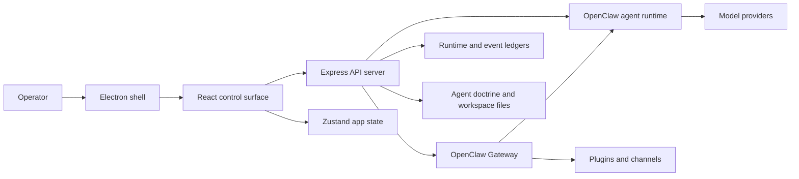

# DystopAI Core


**DystopAI Core is a local-first desktop command center for recruiting, configuring, deploying, and supervising OpenClaw AI agents.** It turns a single chat surface into an operator console for agent rosters, multi-agent parties, structured missions, runtime monitoring, provider auth, skills, and Gateway plugins.

The app is built as a React + TypeScript control surface, an Express API server, and an Electron desktop shell around a vendored OpenClaw runtime.

## What It Is

DystopAI Core is not just a chatbot wrapper. It is an agent operations layer:

- Recruit agents with profiles, capabilities, models, workspace policy, tool policy, and bootstrap markdown.
- Build an active party of agents and send direct, selected, or party-wide Command Console turns.
- Launch missions with collaboration modes, acceptance gates, verification commands, timing, and cron-backed follow-up.
- Monitor active runtime calls, Gateway health, open sessions, logs, channels, plugin state, and stale locks.
- Manage provider auth for API-key and OAuth-backed model lanes.
- Install and inspect OpenClaw plugins and skills, including ClawHub-based workflows.
- Package a standalone desktop build with bundled UI, server, OpenClaw runtime, and required resources.

## Screenshots

Fresh screenshots below were captured from a full browser test against the current Vite app and Control Center backend on June 23, 2026.

| Agents + Command Console | Mission Board |
| --- | --- |
|  |  |

| Runtime Monitor | Plugins |
| --- | --- |
|  |  |

| Agent Editor |
| --- |
|  |

## Core Capabilities

### Agent Roster

The Agents tab is the everyday command surface. It supports a searchable roster, active party slots, direct selection, party confirmation, layout modes, and an always-available Command Console.

Agents are typed with:

- Identity: name, class, role, rarity, portrait, and behavior profile.
- Capabilities: code, planning, research, orchestration, and memory.
- Model policy: primary model, fallbacks, thinking level, timeouts, and provider auth.
- Runtime policy: sandbox, workspace, tools, heartbeat cadence, and recovery mode.
- Doctrine files: `IDENTITY.md`, `SOUL.md`, `BOOTSTRAP.md`, `AGENTS.md`, `USER.md`, `HEARTBEAT.md`, `MEMORY.md`, `TOOLS.md`, and `MISSION_PROMPT.md`.

### Command Console

The Command Console sends user turns to one agent, selected agents, or the confirmed party. Normal console turns prefer the OpenClaw Gateway chat path so the app behaves like a first-class OpenClaw client:

- Stable session keys such as `agent:<agentId>:control-center:console`.
- Gateway `chat.send` dispatch.
- Live `chat` delta events streamed back through SSE.
- Durable final text read from `chat.history` or `chat.message.get`.
- `chat.abort` support when the user stops an active run.
- CLI and embedded local fallback when Gateway transport is unavailable.

### Missions

Missions convert an objective into coordinated work. The mission builder includes templates, mission type, collaboration style, acceptance evidence, verification commands, and timing.

Supported collaboration modes:

- `Command`: slot 1 delegates and synthesizes.
- `Parallel`: every selected agent starts immediately.
- `Specialist`: only agents with the right capability run.
- `Relay`: agents work in order and hand off context.
- `Swarm`: broad research or ideation across many lanes.

Supported timing modes:

- `Strike`: one leader-worker-review cycle.
- `Shift`: cron cycles until a configured time ends.
- `Loop`: cron cycles until stopped.
- `Watch`: persistent background monitoring.

### Runtime Monitor

The Monitor tab is the control room for live operations:

- Gateway lifecycle: health, PID, uptime, readiness, restart, stop, and start.
- Runtime runs: active calls, recent calls, failure kinds, and timing.
- Sessions: open agent sessions, session files, locks, stale locks, and cleanup actions.
- Logs: Gateway log tail, lifecycle entries, channel activity, and diagnostic summaries.
- Cron missions: scheduled jobs, next run, owner agent, cadence, and stop/update controls.
- Clean Slate: UI/runtime monitor cleanup without blindly killing active Gateway work.

### Plugins And Skills

DystopAI Core exposes OpenClaw's plugin and skill ecosystem inside the app:

- List installed, enabled, disabled, and setup-required plugins.
- Inspect plugin commands, providers, channels, dependencies, config fields, and runtime status.
- Install and update plugins through OpenClaw/ClawHub flows.
- Configure ClawTalk and restart Gateway-backed plugin surfaces.
- List bundled, learned, shared, and ClawHub skills.
- Let agents learn reusable skills from successful work.

### Provider Auth

The backend catalogs many provider lanes and their expected credentials. Common paths include:

- OpenAI API keys and OpenAI Codex OAuth.
- Anthropic, Google Gemini, Google Vertex, DeepSeek, OpenRouter, xAI, Groq, Mistral, Qwen/DashScope, Kimi/Moonshot, Cerebras, DeepInfra, Fireworks, Together, Hugging Face, NVIDIA, and more.
- Local or optional-auth providers such as Ollama, LM Studio, vLLM, SGLang, Comfy, DuckDuckGo, and SearXNG where supported by the active OpenClaw config.

Provider credentials are local environment/config concerns. Do not commit secrets. The repo ignores `.env`, `client_secret.json`, `*secret*.json`, and `*credentials*.json`.

## Architecture



### Frontend

- React 19, TypeScript, Vite, Tailwind CSS, Framer Motion, and Zustand.
- Main shell: `src/components/layout/NexusShell.tsx`.
- Agent console: `src/components/monitor/AgentResponseConsole.tsx`.
- Mission builder: `src/components/mission/MissionDeploymentPanel.tsx`.
- Runtime monitor: `src/components/monitor/LiveOperationMonitor.tsx`.
- Plugin manager: `src/components/plugins/PluginsPanel.tsx`.
- Recruit flow: `src/components/recruit/RecruitAgentModal.tsx`.

### Backend

- Express 5 API in `server/index.ts`.
- Runtime ledgers in `server/runtimeLedger.ts`.
- Static production UI served from `dist`.
- OpenClaw state rooted at `OPENCLAW_STATE_DIR` / `OPENCLAW_HOME`, defaulting to the user's OpenClaw state directory.
- Local Control Center ledgers under `control-center-ledger`.
- Gateway-backed command execution with SSE bridging for live console output.

### Desktop Shell

- Electron entry: `electron/main.cjs`.
- Default desktop API port: `4050`.
- Default Vite dev port: `5173`.
- Default OpenClaw Gateway port: `18789`.
- Default browser relay port: `18792`.
- User data defaults to `~/.dystopai-control-center`.
- Packaged builds include `dist`, `dist-server`, `vendor/openclaw`, agent resources, and desktop icons.

## Quick Start

### Prerequisites

- Node.js `22.19+` recommended. Node `24` also works.
- npm.
- Git.
- Provider credentials or OAuth setup for whichever models you want to run.

### Install

```bash
npm install
```

For reproducible verification or release work, prefer the checked-in lockfile:

```bash
npm ci
```

### Run In Development

```bash
npm run dev
```

Open the Vite UI:

```text
http://127.0.0.1:5173/
```

The backend API runs on:

```text
http://127.0.0.1:4050/
```

If prompted for a local token, use the token configured for this Control Center. When `CONTROL_CENTER_TOKEN` is not set, the server generates a one-time local token and prints it in the startup log. Set a stable token before sharing access:

```bash
CONTROL_CENTER_TOKEN="your-local-token" npm run dev
```

### Run The Desktop App Locally

```bash
npm run build:standalone
npm run desktop
```

### Package For Windows

```bash
npm run dist:win
```

The packaging script builds the client/server, prepares runtime bundles, and writes generated output under ignored folders such as `release/` and `artifacts/`.
Runtime bundle prep is pinned: Node archives are verified against Node's published `SHASUMS256.txt`, and the bundled Codex plugin installs an exact package version with a checked npm integrity value.
After generating release output, run `npm run release:evidence` to write `release/evidence/dystopai-sbom.cdx.json`, `release/evidence/checksums.sha256`, and `release/evidence/release-evidence.json`. Publish those files with the installer output so operators can verify the shipped dependency graph and artifact hashes.

## Common Commands

| Command | Purpose |
| --- | --- |
| `npm run dev` | Start backend and Vite frontend together. |
| `npm run dev:server` | Start the Express backend with `tsx watch`. |
| `npm run dev:client` | Start Vite on `127.0.0.1:5173`. |
| `npm run build` | Type-check and build the frontend. |
| `npm run build:server` | Bundle the Express server to `dist-server/index.cjs`. |
| `npm run build:standalone` | Build both frontend and server. |
| `npm run desktop` | Build standalone output and launch Electron. |
| `npm run lint` | Run ESLint across the repo. |
| `npm run smoke:openclaw` | Run OpenClaw contract, redaction, SSE, and stream smoke tests. |
| `npm run smoke:ui` | Run Electron UI smoke checks against the built frontend. |
| `npm run docs:openclaw:sync` | Refresh the local OpenClaw documentation snapshot. |
| `npm run setup:gateway-auth` | Prepare local Gateway auth config. |
| `npm run dist:win` | Create the Windows desktop distribution output. |
| `npm run release:evidence` | Generate the release SBOM, checksum manifest, and evidence summary. |

## Configuration

The app is local-first and mostly controlled by environment variables plus the OpenClaw config it manages.

| Variable | Default | Use |
| --- | --- | --- |
| `CONTROL_CENTER_PORT` | `4050` | Backend/API and packaged app port. |
| `CONTROL_CENTER_FRONTEND_PORT` | `5173` | Vite development frontend port. |
| `CONTROL_CENTER_TOKEN` | generated per launch | Local app login token. |
| `CONTROL_CENTER_WORKSPACE_ROOT` | current repo or OpenClaw workspace | Workspace root exposed to agents. |
| `CONTROL_CENTER_AUTOSTART_GATEWAY` | `1` when Gateway sessions are enabled | Start Gateway automatically for agent runs. |
| `CONTROL_CENTER_GATEWAY_AGENT_SESSIONS` | `1` | Prefer Gateway-backed console sessions. |
| `CONTROL_CENTER_GATEWAY_CHAT_CLIENT` | `1` | Keep a persistent lightweight Gateway chat client. |
| `CONTROL_CENTER_FORCE_LOCAL_AGENT_RUNTIME` | unset | Force embedded local execution instead of Gateway chat. |
| `OPENCLAW_GATEWAY_PORT` | `18789` | OpenClaw Gateway port. |
| `OPENCLAW_BROWSER_RELAY_PORT` | `18792` | Browser relay port. |
| `OPENCLAW_STATE_DIR` / `OPENCLAW_HOME` | user OpenClaw state dir | Runtime state, config, agents, skills, ledgers. |
| `OPENCLAW_CONFIG_PATH` | `<state>/openclaw.json` | Active OpenClaw config file. |
| `OPENCLAW_GATEWAY_LOG_PATH` | `<state>/gateway.log` | Gateway log file. |
| `OPENCLAW_BIN` | auto-detected | Explicit OpenClaw runtime binary/script. |
| `DYSTOPAI_USER_DATA_DIR` | `~/.dystopai-control-center` | Electron user data directory. |
| `DYSTOPAI_DEFAULT_AGENT_MODEL` | DeepSeek default | Seed/default model override. |
| `DYSTOPAI_BUNDLED_NODE_VERSION` | `v24.16.0` | Exact Node runtime version packaged with desktop builds. |
| `DYSTOPAI_BUNDLED_CODEX_SPEC` | `@openclaw/codex@2026.6.10` | Exact Codex plugin package bundled for OpenClaw. |
| `DYSTOPAI_BUNDLED_CODEX_INTEGRITY` | pinned sha512 | Required npm integrity when overriding the bundled Codex spec. |
| `DYSTOPAI_BUNDLED_CODEX_TARBALL` | pinned npm tarball | Optional tarball assertion for the bundled Codex package. |

## Repository Layout

```text
.
|-- electron/                 # Electron shell, process management, desktop integration
|-- server/                   # Express API, OpenClaw bridge, ledgers
|-- src/                      # React app, store, UI components, engine helpers
|-- public/                   # Brand assets, agent portraits, mission/card art
|-- docs/                     # User guide, OpenClaw docs snapshot, architecture notes
|-- scripts/                  # Build, package, smoke, auth, docs sync utilities
|-- vendor/openclaw/          # Vendored OpenClaw runtime snapshot
|-- build/                    # Source desktop icon assets kept for packaging
|-- dist/                     # Generated frontend build, ignored
|-- dist-server/              # Generated server bundle, ignored
|-- release/                  # Generated Electron output, ignored
`-- artifacts/                # Generated zips/reports, ignored
```

## OpenClaw Integration Notes

This repo includes a local OpenClaw docs snapshot at:

```text
docs/openclaw-latest
docs/openclaw-latest/pages
```

When changing Gateway, Command Console, ClawTalk, runtime, tool routing, sessions, plugins, or Control Center behavior, read the local OpenClaw docs first. Useful starting points:

- `docs/openclaw-latest/pages/gateway/protocol.md`
- `docs/openclaw-latest/pages/web/webchat.md`
- `docs/openclaw-latest/pages/web/control-ui.md`
- `docs/openclaw-latest/pages/cli/agent.md`
- `docs/OPENCLAW_GATEWAY_COMMAND_CONSOLE_GUIDE.md`

Refresh the snapshot when upstream behavior matters:

```bash
npm run docs:openclaw:sync
```

## Validation

Run these before pushing changes:

```bash
npm run lint
npm run build
npm run smoke:openclaw
```

For UI smoke checks, build first:

```bash
npm run build
npm run smoke:ui
```

For server bundle validation:

```bash
npm run build:standalone
```

## Security And Local Data

DystopAI Core is designed as a local operator app. Treat it like an admin console:

- Keep `CONTROL_CENTER_TOKEN` private.
- Keep provider API keys and OAuth client secrets out of Git.
- Review generated agent doctrine before giving agents broad workspace/tool access.
- Use the Monitor tab to inspect active runs, sessions, Gateway logs, and stale locks.
- Use plugin setup flows carefully because plugins may add providers, channels, commands, and external integrations.

Ignored local/generated data includes:

- `node_modules/`
- `.openclaw/`, `.runtime/`, `.cache/`, `.tmp/`
- `dist/`, `dist-server/`, `release/`, `artifacts/`, `output/`, `reports/`
- `.env`, `client_secret.json`, `*secret*.json`, `*credentials*.json`
- local memory/session/runtime folders

## Troubleshooting

### The UI asks for a token

Use the local token configured for this Control Center. If no token was configured, check the server startup log for the generated one-time token. For a stable local token, set:

```bash
CONTROL_CENTER_TOKEN="your-local-token"
```

### Gateway is offline

Use the Monitor tab to start or restart Gateway. From the terminal, confirm the configured port:

```bash
echo $OPENCLAW_GATEWAY_PORT
```

On Windows PowerShell:

```powershell
$env:OPENCLAW_GATEWAY_PORT
```

### A model cannot run

Check the agent's Model tab first. Most failures are missing auth, expired OAuth, unsupported provider model IDs, stale Gateway config, or a provider quota issue.

### Command Console hangs or needs a reset

Use the stop control in the Command Console, then check Monitor for active runs and sessions. If stale UI/runtime state remains, use Clean Slate from Monitor.

### Desktop packaging cannot find icons

The desktop packager expects icons under `build/`. This repo keeps only `build/icon*.png` and `build/icon*.svg` tracked; generated build outputs remain ignored.

## Project Status

Current package version: `0.0.6`.

This is an active local-first desktop app around a fast-moving OpenClaw runtime. The most important development rule is simple: keep the operator experience responsive, observable, and recoverable while staying aligned with OpenClaw Gateway protocol behavior.
