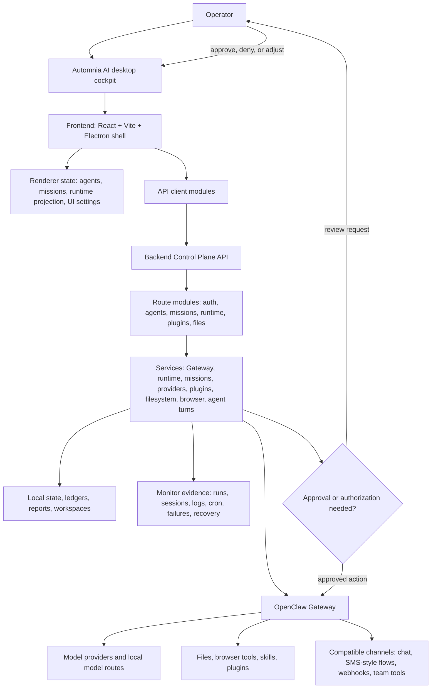

<div align="center">


# Automnia AI

### A local-first desktop command center for hyper customizable agents

Build specialized agents. Give each one models, tools, workspaces, schedules, plugins, channels, memory, doctrine, and rules. Watch what they do in real time. Approve what matters.

**AI Nexus** · **Custom agents** · **Missions** · **Schedules** · **Plugins** · **Runtime monitor** · **Approval-first automation**

[User Guide](docs/USER_GUIDE.md) · [Beta Notes](docs/BETA_RELEASE_NOTES.md) · [Data Handling](DATA_HANDLING.md) · [Security](SECURITY.md) · [Release Governance](docs/RELEASE_GOVERNANCE.md)

</div>

## What is Automnia AI?

Automnia AI gives you the cockpit for running AI agents like a local operations team.

Instead of one endless chat thread, agents can have their own roles, personalities, model lanes, workspaces, tools, schedules, memories, skills, plugins, channels, and approval rules.

```text
Create agents.
Give each one a lane.
Send work.
Schedule missions.
Watch the runtime.
Approve important actions.
Read the evidence.
```

## Why it feels different

| One chat box | Automnia AI |
| --- | --- |
| One personality | Many specialized agents |
| Few model choices | Dozens of supported model routes, with per-agent model lanes, fallbacks, thinking levels, and timeouts |
| One messy history | Separate workspaces, sessions, doctrine, and memory |
| Blind waiting | Live runtime, Gateway, mission, plugin, and log visibility |
| Prompt and hope | Missions, schedules, approvals, and final reports |
| Manual babysitting | Recovery controls, status checks, and repeatable workflows |

## What you can build

| Build this | What it does |
| --- | --- |
| **Code crew** | Architect, builder, reviewer, tester, and release-check agents working inside one approved repo. |
| **Customer service agent** | Reviews customer emails, prepares replies, organizes inquiry context, and routes follow-ups through configured email, call, text, or channel tools. |
| **Shopify store operator** | Uses Shopify CLI or compatible store tools to inspect inventory, orders, website data, SEO tasks, product details, and promotional codes. |
| **Store command center** | Combines inventory checks, order review, customer inquiry drafts, promotion planning, and store intelligence on a schedule. |
| **Promotional agent** | Prepares campaign copy, recurring outreach drafts, launch posts, discount campaigns, and scheduled promotional plans for review. |
| **Content studio** | Plans scripts, hooks, titles, descriptions, thumbnails, launch posts, and media-generation workflows using configured Gemini, image/video, or other supported models and tools. |
| **Research desk** | Compares sources, separates facts from assumptions, and returns a decision-ready brief. |
| **Watcher** | Checks configured products, prices, releases, jobs, markets, alerts, or system signals on a cadence. |
| **Mission control** | Turns a goal into assigned agents, timing, risk, acceptance criteria, recovery, and proof. |

## Agent customization

| Customize | Examples |
| --- | --- |
| **Identity** | Builder, analyst, reviewer, marketer, support rep, commander, personal operator. |
| **Model lane** | Different primary models, fallbacks, thinking levels, timeouts, and provider setup. |
| **Workspace** | Give one agent a project folder, another a docs folder, another no file access at all. |
| **Doctrine** | Store agent rules, tone, memory, operating style, and mission instructions. |
| **Tools** | Browser, files, runtime, plugins, skills, channels, and service integrations where configured. |
| **Schedule** | Run now, run for a timed mission, repeat on cadence, or watch for changes. |

## Architecture map



<details>
<summary><strong>Open the wiring map</strong></summary>

| Layer | What it does |
| --- | --- |
| **Electron shell** | Starts the desktop app, protects the local session path, and hosts the UI. |
| **Frontend** | React/Vite interface for Agents, Missions, Monitor, Plugins, Settings, and the Command Console. |
| **Renderer state** | Keeps UI state separate from backend truth: selected agents, mission projection, runtime projection, command-console state, and preferences. |
| **API modules** | Keep frontend calls organized instead of scattering raw endpoints through components. |
| **Control Plane API** | Local backend boundary for auth, missions, runtime status, plugins, files, provider setup, and diagnostics. |
| **Route modules** | Keep HTTP endpoints split by domain so the backend is not one giant route file. |
| **Service layer** | Owns the real work: Gateway lifecycle, agent turns, mission state, runtime recovery, provider setup, plugin actions, uploads, browser preflight, and filesystem safety. |
| **OpenClaw Gateway** | Runs the agent runtime, sessions, plugins, tools, channels, and model/provider paths. |
| **Approval loop** | Keeps the operator in the loop when a workflow needs confirmation, authorization, or a high-impact decision. |
| **Monitor evidence** | Shows what is running, what failed, what was scheduled, what needs recovery, and what proof came back. |

</details>

The goal is simple: make powerful agent workflows visible, configurable, repeatable, and recoverable.

## Start simple

The README is the front door. The [User Guide](docs/USER_GUIDE.md) is the complete operating manual, including advanced workflows, provider setup, missions, plugins, recovery, screenshots, skills, channels, and configuration details.

```bash
git clone <this repository>
cd <this repository>
npm ci
npm run desktop
```

For deeper setup and advanced workflows, read:

- [User Guide](docs/USER_GUIDE.md)
- [Beta Release Notes](docs/BETA_RELEASE_NOTES.md)
- [Data Handling](DATA_HANDLING.md)
- [Security Policy](SECURITY.md)

## Current status

Automnia AI is a **public beta** for Windows, macOS, and Linux.

### Interface preview

| Agents | Missions |
| --- | --- |
|  |  |

| Monitor | Plugins |
| --- | --- |
|  |  |

## Documentation map

| Need | Go here |
| --- | --- |
| Learn the app | [User Guide](docs/USER_GUIDE.md) |
| Understand beta limits | [Beta Release Notes](docs/BETA_RELEASE_NOTES.md) |
| Data and privacy model | [Data Handling](DATA_HANDLING.md) |
| Security reporting and local boundary | [Security](SECURITY.md) |
| Release rules | [Release Governance](docs/RELEASE_GOVERNANCE.md) |

## Release evidence

Public release candidates must run through the hosted release workflows. Validate packaged artifacts with `npm run release:validate`, then generate detached release evidence with `npm run release:sign` using an Ed25519 key from `DYSTOPAI_RELEASE_SIGNING_PRIVATE_KEY_FILE` or `DYSTOPAI_RELEASE_SIGNING_PRIVATE_KEY_PEM`; public-release runs keep `DYSTOPAI_RELEASE_REQUIRE_SIGNING` enabled so missing signing material fails closed. Public release validation also requires consumer distribution signing evidence in `distribution-signing.json` before publishing.

## Pitch

**Automnia AI turns customizable agents into a visual local operations system: real missions, scheduled automation, plugin-powered workflows, live runtime visibility, and approval-first control, powered by OpenClaw.**
