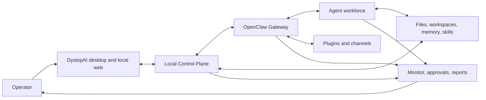
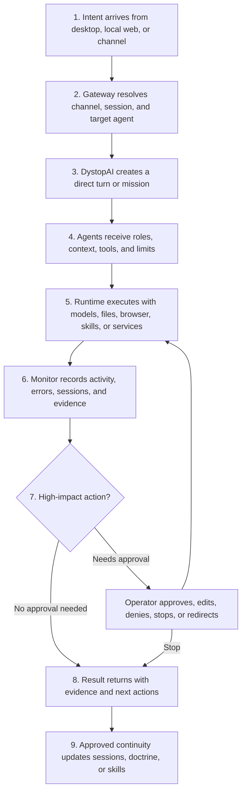

<div align='center'>


# DystopAI

### A local-first command center for AI agents that can work, watch, message, schedule, and report

DystopAI turns one instruction into coordinated work across specialized agents, missions, plugins, tools, channels, schedules, approvals, and live runtime controls.

**Multi Model Nexus** · **Local-first** · **Agent teams** · **Mission automation** · **Plugin-powered helpers** · **Human approval**

</div>

<p align='center'>
  
</p>

> [!IMPORTANT]
> DystopAI Core is a powerful local operator console. It can coordinate agents with access to files, tools, models, browsers, communication channels, plugins, and runtime state. Keep the Control Plane bound to the local machine. Remote operation should flow through authenticated OpenClaw channels or plugins, not by exposing the local API directly to the public internet.

## What Is DystopAI?

**DystopAI is the operating desk between your intent and a workforce of AI agents.**

A normal AI chat gives you one assistant in one box. DystopAI gives you a roster: builders, researchers, reviewers, analysts, operators, assistants, coordinators, support agents, automation agents, and any custom role your workflow needs.

Each agent can have its own model, personality, memory, workspace, tools, policies, schedule, and job lane. You can talk to one specialist, deploy a small team, or launch a mission where agents divide the work and return proof.

DystopAI brings the whole loop into one desktop system:

- **Agents** for role-specific helpers with models, tools, workspaces, memory, and doctrine.
- **Missions** for structured goals with timing, roles, risk settings, proof, and reports.
- **Plugins** for channels, model providers, browser automation, memory, skills, tools, and service integrations.
- **Schedules** for one-time, recurring, looped, and watch-style work.
- **Monitor** for live runtime health, active calls, sessions, cron jobs, channel traffic, failures, and recovery.
- **Approval gates** so agents can prepare important actions while you keep final authority.

The result feels less like opening a chatbot and more like running a small digital command room. 🛰️

## The 60-Second Version

Tell DystopAI what you want:

```text
Every Friday morning, prepare next week’s grocery list from my meal plan and send it to me for approval.
```

DystopAI can route that intent through the pieces that matter:

```text
Goal
+ the right agent or active party
+ workspace and memory
+ plugin capabilities
+ schedule or watch mode
+ approval boundary
+ runtime evidence
= controlled AI work
```

That same pattern works for code review, research, release checks, customer responses, market or product alerts, household routines, content planning, browser-assisted tasks, and custom workflows built from plugins.

## Why It Exists

Useful AI agents need more than a prompt window. They need clear roles, real tools, safe boundaries, visibility, scheduling, and a way to recover when something stalls.

| What users need | What DystopAI gives them |
| --- | --- |
| **Specialists** | Agents with roles, personalities, models, tools, workspaces, memory, and policies. |
| **Coordination** | Active parties, lead agents, direct commands, selected-agent turns, and multi-agent missions. |
| **Repeatable work** | Missions with objectives, modes, timing, risk, acceptance gates, verification, and reports. |
| **Time awareness** | Immediate, timed, looping, watch-style, cron-backed, and recurring operations. |
| **Expandable powers** | Plugins for providers, channels, browser automation, files, skills, memory, and external services. |
| **Remote reach** | Desktop and local web control plus compatible OpenClaw channel and plugin surfaces. |
| **Trust and control** | Stop controls, logs, approvals, session cleanup, Gateway recovery, diagnostics, and release evidence. |
| **Continuity** | Agent doctrine, local state, workspaces, sessions, learned skills, mission ledgers, and runtime history. |

DystopAI is built so the exciting part stays usable and the powerful part stays observable.

## What You Can Build With It

| Use case | What it can look like |
| --- | --- |
| **Personal AI operator** | A helper that prepares reminders, plans groceries, checks messages, drafts replies, and waits for approval before acting. |
| **Software command team** | Architect, builder, reviewer, testing, and security agents working against a real repository with verification steps. |
| **Research desk** | Multiple agents gathering facts, separating assumptions, comparing options, and returning a clear decision brief. |
| **Business watcher** | Watch missions that monitor products, competitors, prices, inventory, launches, system health, or support queues. |
| **Content studio** | Agents for outlines, scripts, graphics briefs, publishing plans, repurposing, and scheduled follow-ups. |
| **Support assistant** | A channel-connected helper that drafts customer responses and pauses before sending. |
| **Local automation hub** | A desktop-first control layer that can use tools, plugins, schedules, and approvals without requiring a DystopAI cloud service. |

## What Makes It Different

### 1. It is an agent roster, not one renamed assistant

Create agents with real lanes: architect, builder, reviewer, tester, analyst, researcher, operator, marketer, assistant, support, coordinator, or any role your workflow needs.

Each agent can carry:

- A name, portrait, role, class, level, rarity, tags, and description.
- A primary model, fallback models, reasoning level, timeout, and provider authentication.
- A dedicated workspace with sandbox and read/write policy.
- Tool allowlists, tool denylists, and runtime boundaries.
- Heartbeat cadence, loop/watch behavior, idle timeout, and recovery mode.
- Skills from the local library, learned skills, shared skills, and ClawHub.
- Doctrine files such as `IDENTITY.md`, `SOUL.md`, `BOOTSTRAP.md`, `AGENTS.md`, `USER.md`, `HEARTBEAT.md`, `MEMORY.md`, `TOOLS.md`, and `MISSION_PROMPT.md`.

A coding agent can live in a repository. A research agent can live in a documents folder. A support agent can have a communication channel. A household assistant can run scheduled routines. They do not need to share one crowded brainpan.

### 2. Missions turn ideas into controlled work

A mission is a goal with an operating frame around it.

```text
Objective
+ selected agents
+ collaboration mode
+ timing
+ risk tolerance
+ acceptance gates
+ verification commands
+ stop conditions
= controlled agent work
```

Mission types include `Build`, `Plan`, `Research`, `Command`, and `Memory`.

Dispatch modes include `Command`, `Parallel`, `Specialist`, `Relay`, and `Swarm`.

Timing modes include `Strike`, `Timed`, `Loop`, and `Watch`. Repeating work is backed by OpenClaw cron state instead of a cosmetic frontend timer.

Mission reports can preserve participation, runtime references, retries, failures, verification results, session identifiers, elapsed time, and unavailable metrics instead of pretending everything worked.

### 3. Plugins turn agents into hyper-custom helpers

ClawTalk is only one communication surface. The bigger power is the plugin layer.

Plugins are how DystopAI agents gain new senses, hands, memories, and doorways. A plugin can make an agent reachable through a channel, give it access to a model provider, let it use browser automation, expose memory or skills, connect an external service, or add a custom workflow surface.

| Plugin category | What it can unlock |
| --- | --- |
| **Communication channels** | Route work through compatible SMS, voice, walkie-style chat, Discord, Google Chat, iMessage, Matrix, Microsoft Teams, Signal, Slack, Telegram, WhatsApp, WebChat, webhooks, or future plugin channels. |
| **Model providers** | Give different agents different models, fallback models, auth methods, and provider lanes. |
| **Browser and tool plugins** | Let agents inspect pages, use browser flows, gather context, operate inside approved workspaces, or run tool-assisted tasks. |
| **Memory and skills** | Add continuity, reusable playbooks, learned procedures, role-specific abilities, and shared skill libraries. |
| **Service integrations** | Connect agents to the systems your workflow depends on, as long as the plugin, credentials, and tool policy support it. |

That is how a generic assistant becomes a custom helper: an agent gets a job, a workspace, a memory, a schedule, a channel, and the right tools. Tiny digital locksmith, giant keyring. 🗝️

> [!NOTE]
> Channel, plugin, approval, and automation availability depends on the installed OpenClaw runtime, operating system, plugin version, credentials, and tool configuration. DystopAI is intentionally channel-agnostic. ClawTalk is bundled, useful, and important, but it is not the boundary of the platform.

### 4. Channels let agents meet you where you already are

The desktop app and local web surface are first-class control surfaces. Compatible plugins can also make agents reachable through messages, voice, team chat, webhooks, and future channels.

Examples:

```text
@Diana summarize the overnight alerts
@hn-builder inspect the failed build and report the first blocker
@Commander stop the active mission and return current evidence
```

A remote command can enter through a configured channel, route to the correct agent, become a mission, use local or networked tools, pause at an approval boundary, and return evidence through the same communication path.

### 5. Monitor shows what the system is doing

The Monitor answers the operator’s most important question:

> **What is running right now, and can I trust it?**

Inspect:

- Gateway health, process state, port, PID, uptime, readiness, start, stop, and restart actions.
- Active and recent agent calls.
- Open sessions, session files, locks, stale locks, and cleanup controls.
- Cron jobs, scheduled shifts, next-run timing, retries, and stop actions.
- Plugin status and setup requirements.
- Inbound, outbound, and system channel activity.
- Runtime logs, diagnostic summaries, failures, and recovery evidence.
- Agent phases, tool activity, browser activity, file activity, partial output, final output, and approval events when supplied by the runtime.
- Clean Slate recovery when UI or runtime evidence becomes stale.

Live activity is not decoration. It is the evidence trail that lets you interrupt, verify, redirect, and recover agent work.

### 6. Human authority stays in the loop

Agents can prepare important actions, but the operator should keep final authority over high-impact work.

Use approval gates before:

- Purchases or checkout flows.
- Outbound messages to other people.
- Account changes.
- File deletion or destructive edits.
- Deployments, releases, or GitHub pushes.
- Trades, payments, or other financial actions.
- Any workflow where a wrong action costs more than a wrong draft.

DystopAI is powerful because it can connect agents to real tools. It is safer because the system is built around policy, visibility, and stop controls.

## Product Tour

| Agents | Missions |
| --- | --- |
|  |  |

| Runtime Monitor | Plugins |
| --- | --- |
|  |  |

| Agent Settings |
| --- |
|  |

## Core Product Surfaces

| Surface | What users do there |
| --- | --- |
| **Recruit** | Create a new agent profile, role, model lane, workspace, and starter doctrine in one guided flow. |
| **Agents** | Browse the roster, deploy the active party, edit specialists, and issue live commands. |
| **Command Console** | Talk to one agent, selected agents, or the confirmed party, attach files, stream output, and stop active work. |
| **Missions** | Define structured objectives, dispatch modes, cadence, risk, acceptance gates, verification, and reports. |
| **Monitor** | Watch Gateway health, calls, sessions, cron jobs, channels, logs, failures, and recovery actions. |
| **Plugins** | Manage providers, tools, communication channels, setup flows, skills, memory, and extension state. |
| **Agent Editor** | Configure models, authentication, workspaces, runtime policy, sandboxing, tools, skills, schedule, and doctrine. |

## Example Workflows

| Goal | Example operator request | DystopAI controls involved |
| --- | --- | --- |
| **Software delivery** | “Launch a Build mission with an architect, builder, and reviewer. Require lint, typecheck, and an exact changed-file report.” | Agent roles, workspace isolation, acceptance gates, verification, stop controls. |
| **Codebase health** | “Check my app, summarize the failures, and do not modify anything.” | Read-only policy, direct agent command, live activity, final evidence. |
| **Research map** | “Compare these products, separate facts from assumptions, and return unresolved questions.” | Research mission, parallel specialists, source requirements, synthesis. |
| **Business monitoring** | “Watch these product pages and alert me only when price, inventory, or release status changes.” | Watch mission, browser/plugin tools, scheduler, preferred channel. |
| **Personal operations** | “Every Friday, prepare next week’s grocery list from my meal plan and send it for approval.” | Recurring schedule, memory, communication plugin, approval boundary. |
| **Customer response** | “Draft the customer reply, wait for approval, then send through the connected channel.” | Specialist agent, tool policy, approval event, channel routing. |
| **Release review** | “Run a release-readiness mission, collect test evidence, list blockers, and never push to GitHub.” | Mission risk settings, command restrictions, verification report. |
| **Emergency control** | “Stop all active runs and tell me what was interrupted.” | Gateway controls, cron stop actions, session inspection, runtime summary. |

These are operating patterns, not hardcoded demos. Exact behavior depends on the models, tools, plugins, credentials, workspaces, and permissions configured by the operator.

## How The Pieces Work Together

DystopAI is reliable because the major responsibilities are separated instead of tangled together.

Think of the app as a set of clear rooms:

1. **Desktop shell** opens the local app and keeps the browser boundary tight.
2. **Control Plane** owns the local API, mission state, policies, and recovery actions.
3. **OpenClaw Gateway** handles sessions, routing, plugins, channels, cron, and runtime work.
4. **Agents** carry the role, model, workspace, tools, skills, and memory needed for a job.
5. **Plugins** add new powers without turning the core app into a knot of one-off integrations.
6. **Monitor** shows what is running, what failed, what needs setup, and what can be stopped or recovered.
7. **Local state** keeps doctrine, workspaces, ledgers, sessions, and release evidence on the operator’s machine unless a configured provider or plugin sends data elsewhere.

The sweet part: every serious action has a path in, a runtime owner, a place to record evidence, and a way for the operator to stop or recover it.



## Why The Architecture Is Dependable

DystopAI is designed for real operator use, not just a shiny demo screen.

| Reliability choice | Why it matters to users |
| --- | --- |
| **Local-first control** | Your main app state, agent files, workspaces, ledgers, and runtime data stay on your machine by default. |
| **Separated layers** | The UI, local API, Gateway, agents, plugins, and state each have a clear job, which makes the system easier to inspect and repair. |
| **Real runtime ownership** | Missions, sessions, plugin activity, cron jobs, and channel events are backed by the runtime instead of only living as frontend animation. |
| **Observable work** | Monitor gives you health, active calls, logs, channel activity, cron state, failures, and recovery actions. |
| **Approval boundaries** | Agents can draft, prepare, and explain high-impact actions before the operator confirms execution. |
| **Route inventory checks** | The Control Plane tracks 107 unique API routes so important app paths cannot silently disappear or duplicate. |
| **Recovery controls** | Gateway restart, session cleanup, Clean Slate, stale lock cleanup, and stop controls give operators a way out when work gets stuck. |
| **Release evidence** | Build, test, package, signing, and release checks can produce evidence tied to the exact artifacts being distributed. |

In plain English: DystopAI has bones. The app is not just a pretty dashboard painted over chaos. It has a local control layer, a runtime layer, plugin boundaries, health checks, and evidence trails.

## How A Command Becomes Work



This closed loop is the core idea: **intent, execution, observation, control, evidence, continuity**.

## Repository Structure

```text
.
|-- electron/                 # Desktop shell, preload bridge, and app lifecycle
|-- server/                   # Local Control Plane, runtime integration, services, and ledgers
|   `-- routes/               # Focused API route owners plus route inventory checks
|-- src/                      # React application
|   |-- components/           # Agents, missions, monitor, plugins, editor, recruit, auth, and layout
|   |-- engine/               # Coordination, runtime composition, validation, and mission reporting
|   |-- hooks/                # Runtime status, API-backed state, and UI orchestration
|   |-- store/                # Command and mission state
|   |-- types/                # Agent, mission, runtime, activity, and coordination contracts
|   `-- utils/                # Streaming, diagnostics, URLs, and shared helpers
|-- public/                   # Brand assets, agent portraits, icons, and mission artwork
|-- docs/                     # User guide, architecture notes, release policy, and OpenClaw snapshot
|-- scripts/                  # Build, test, security, packaging, backup, and release automation
|-- tests/                    # Unit and focused behavior tests
|-- vendor/openclaw/          # Prepared OpenClaw runtime snapshot
|-- build/                    # Desktop packaging assets
|-- dist/                     # Generated frontend build, ignored
|-- dist-server/              # Generated server bundle, ignored
|-- release/                  # Generated desktop artifacts, ignored
`-- artifacts/                # Generated archives and reports, ignored
```

## Start Here

### Prerequisites

- Node.js `24` recommended, or Node.js `22.19+` for compatibility.
- npm.
- Git.
- Credentials or OAuth access for the model providers you plan to use.
- Credentials for any external plugin or communication channel you enable.

### Install

```bash
git clone https://github.com/hotboysupreme12-hash/DystopAI-Core.git
cd DystopAI-Core
npm ci
```

### Launch The Desktop App

```bash
npm run desktop
```

This builds the app, prepares the bundled OpenClaw runtime, and launches the Electron desktop shell.

### Launch Development Mode

```bash
npm run dev
```

Development defaults:

- Frontend: `http://127.0.0.1:5173/`
- Control Plane API: `http://127.0.0.1:4050/`
- OpenClaw Gateway: `127.0.0.1:18789`

When `CONTROL_CENTER_TOKEN` is not configured, the server generates a local session token and reports it in the startup log.

### First Five Minutes

1. Open DystopAI.
2. Connect a model provider or OAuth account.
3. Recruit an agent or select an existing specialist.
4. Deploy agents to the active party and confirm it.
5. Send a direct command or launch a mission.
6. Open Monitor to watch runtime, sessions, cron jobs, channels, and evidence.
7. Add plugins only after the basic agent path works.
8. Put approval gates in front of high-impact workflows.

## Essential Commands

Most users start with just these:

| Command | Purpose |
| --- | --- |
| `npm run dev` | Start the backend and Vite frontend together for development. |
| `npm run desktop` | Build and launch the desktop app. |
| `npm run build:standalone` | Build the production frontend and server bundle. |
| `npm test` | Run the full local quality gate. |

For deeper validation, packaging, and release work:

| Command | Purpose |
| --- | --- |
| `npm run lint` | Run ESLint across source, server, scripts, and tests. |
| `npm run typecheck` | Type-check frontend, server, Electron, and preload surfaces. |
| `npm run smoke:ui` | Verify the production UI render path. |
| `npm run smoke:openclaw` | Verify Gateway, diagnostics, streaming, and agent-turn contracts. |
| `npm run check:bundle-budgets` | Enforce production renderer bundle budgets. |
| `npm run package:desktop` | Create an unpacked desktop package for launch validation. |
| `npm run dist:win` | Create a Windows installer. |
| `npm run dist:mac` | Create a macOS package. |
| `npm run dist:linux` | Create Linux AppImage and Debian outputs. |
| `npm run verify:release-candidate` | Run the release-candidate test, build, budget, and Electron gates. |
| `npm run state:backup` | Create a runtime-state backup. |
| `npm run state:verify` | Verify a runtime-state backup. |
| `npm run state:restore` | Restore a runtime-state backup. |
| `npm run docs:openclaw:sync` | Refresh the local OpenClaw documentation snapshot. |

## Configuration

Most users need two things first: model access and plugin credentials. Advanced local settings are available when you need to change ports, state folders, or runtime paths.

| Variable | Default | Purpose |
| --- | --- | --- |
| `CONTROL_CENTER_PORT` | `4050` | Local Control Plane API and packaged app port. |
| `CONTROL_CENTER_FRONTEND_PORT` | `5173` | Vite development frontend port. |
| `CONTROL_CENTER_TOKEN` | Generated when unset | Local browser session bootstrap token. |
| `CONTROL_CENTER_WORKSPACE_ROOT` | Project or OpenClaw workspace | Root workspace exposed through the Control Plane. |
| `OPENCLAW_GATEWAY_PORT` | `18789` | OpenClaw Gateway port. |
| `OPENCLAW_BROWSER_RELAY_PORT` | `18792` | Browser relay port. |
| `OPENCLAW_STATE_DIR` / `OPENCLAW_HOME` | User OpenClaw state directory | Runtime state, agents, skills, sessions, and configuration. |
| `OPENCLAW_CONFIG_PATH` | `<state>/openclaw.json` | Active OpenClaw configuration file. |
| `DYSTOPAI_USER_DATA_DIR` | `~/.dystopai-control-center` | Electron user data directory. |

Keep provider keys, OAuth credentials, channel credentials, local sessions, generated runtime data, signing keys, and release output outside version control.

## Local-First Data Model

DystopAI is built around local control.

By default:

- DystopAI desktop state lives in `~/.dystopai-control-center`.
- OpenClaw state lives in `~/.openclaw`.
- Agent workspaces remain in operator-selected folders.
- Agent doctrine, mission ledgers, local auth material, and runtime state stay on the operator’s machine.
- DystopAI does not require a DystopAI cloud telemetry service.

Data can still leave the machine when you configure a model provider, plugin, channel, browser action, or tool that sends it elsewhere. Those external services keep their own privacy, auth, logging, and network boundaries.

See [`DATA_HANDLING.md`](DATA_HANDLING.md) before enabling networked tools or sharing diagnostics.

## Security And Control Model

Treat DystopAI like an administrator console for an agent runtime. It is powerful because it can connect agents to real files, tools, models, channels, and plugins.

The current safety model focuses on local operation, bounded access, and visible control:

- The Control Plane is intended to bind only to loopback addresses.
- Browser access requires a local bearer session plus exact local-origin validation.
- Browser sessions are expiring, bounded, revocable, and stored in session-scoped renderer storage.
- The Electron renderer uses context isolation, sandboxing, restricted navigation, denied popup creation, and a narrow preload bridge.
- The Electron launch secret is exchanged for a short-lived server session and is not exposed through the renderer bridge.
- Gateway setup is token-first. Password fallback is used only when explicitly supplied.
- Agent filesystem, shell, browser, communication, and provider access are governed by operator-selected workspace, sandbox, and tool policy.
- High-impact operations should use approval boundaries and least-privilege tools.
- Exposing the Control Plane to a LAN or the public internet is outside the current threat model.

See [`docs/RELEASE_GOVERNANCE.md`](docs/RELEASE_GOVERNANCE.md) and [`DATA_HANDLING.md`](DATA_HANDLING.md) for the detailed trust boundary.

## Release Confidence

DystopAI treats release work as evidence, not vibes.

Public release candidates should be qualified from the exact bytes that will be distributed.

```bash
npm run verify:release-candidate
npm run dist:win
npm run release:update-manifest
npm run release:update-verify
npm run release:lifecycle:windows
npm run release:evidence
DYSTOPAI_RELEASE_SIGNING_PRIVATE_KEY_FILE=C:/secure/dystopai-release-ed25519.pem npm run release:sign
DYSTOPAI_RELEASE_REQUIRE_SIGNING=1 npm run release:validate
```

The release flow can record artifact size, SHA-256 digest, update metadata, signing evidence, install and uninstall validation, rollback continuity, and distribution evidence. Private signing keys must never be committed.

## Documentation

- [`docs/USER_GUIDE.md`](docs/USER_GUIDE.md): operator walkthrough for agents, missions, monitoring, plugins, ClawTalk, and model authentication.
- [`docs/OPENCLAW_GATEWAY_COMMAND_CONSOLE_GUIDE.md`](docs/OPENCLAW_GATEWAY_COMMAND_CONSOLE_GUIDE.md): Gateway protocol and Command Console integration.
- [`docs/PRODUCTION_RELEASE_RUNBOOK.md`](docs/PRODUCTION_RELEASE_RUNBOOK.md): signed Windows qualification and publication sequence.
- [`docs/RELEASE_GOVERNANCE.md`](docs/RELEASE_GOVERNANCE.md): CI, signing, evidence, release, and threat-model policy.
- [`docs/PRODUCTION_HARDENING_LEDGER.md`](docs/PRODUCTION_HARDENING_LEDGER.md): production-readiness ledger and engineering backlog.
- [`DATA_HANDLING.md`](DATA_HANDLING.md): local state, providers, telemetry, channels, and operator data boundaries.
- [`THIRD_PARTY_NOTICES.txt`](THIRD_PARTY_NOTICES.txt): generated dependency and license inventory.
- [`docs/openclaw-latest/`](docs/openclaw-latest/): local OpenClaw documentation snapshot used by the project.

## Project Status

Current package version: `0.0.6`.

DystopAI Core is an active local-first desktop project built around the OpenClaw runtime. The principal product surfaces are implemented: agent recruitment and configuration, active-party control, live chat, structured missions, cron-backed recurring work, runtime monitoring, plugin and skill management, provider authentication, channel activity, recovery controls, packaging, and release evidence.

The product direction is bigger than any single chat surface:

> **Give intent. Assemble the right agents. Let plugins provide the powers. Let schedules keep the work moving. Watch the runtime. Approve what matters.**
