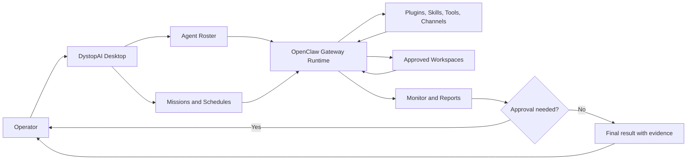

<div align="center">


# DystopAI

### Multi Model Nexus for local-first AI agents, missions, schedules, plugins, and live runtime control

**Build agents. Give them tools. Schedule missions. Watch the work. Approve what matters.**

</div>

<p align="center">
  
</p>

<div align="center">

| Local-first | Agent teams | Live runtime | Scheduled missions | Plugin powered | Approval aware |
| --- | --- | --- | --- | --- | --- |
| Your control center stays on your machine by default. | Each agent has a role, model lane, tools, workspace, and behavior. | Monitor shows what is running, blocked, queued, recovered, or complete. | Missions can run now, later, on cadence, or as watch-style work. | Providers, tools, skills, memory, browser flows, and channels plug in. | High-impact actions can pause for operator review before execution. |

</div>

> [!IMPORTANT]
> DystopAI can connect agents to real files, providers, browsers, plugins, communication channels, and local runtime services. Keep the Control Center and Gateway on loopback. Use approval gates for messages, purchases, deletes, deployments, account changes, GitHub pushes, or anything that affects other people.

---

## The App In One Glance

DystopAI turns AI from one loose chat box into an operating desk.

```text
Recruit agents -> arm the party -> send commands -> launch missions -> watch runtime -> approve actions -> read proof
```

The simple idea:

| What you see | What it means |
| --- | --- |
| **Agents** | A roster of specialized workers with different jobs, models, tools, skills, workspaces, and rules. |
| **Command Console** | A live chat lane that can target one agent, selected agents, or the active party. |
| **Missions** | Structured objectives with timing, dispatch mode, risk, acceptance criteria, and reports. |
| **Plugins** | The power layer: providers, tools, memory, skills, channels, browser flows, and service integrations. |
| **Monitor** | The truth board for Gateway health, running calls, sessions, cron jobs, logs, channel traffic, and recovery. |

You do not manage a pile of random prompts. You command a crew.

---

## Showcase

| Agents | Missions |
| --- | --- |
|  |  |

| Runtime Monitor | Quiet Monitor |
| --- | --- |
|  |  |

<details>
<summary>Plugin runtime</summary>


</details>

<details>
<summary>Agent settings</summary>


</details>

---

## What Makes It Feel Powerful

### 1. Agents are not just names in a sidebar

Each agent can carry its own operating lane:

| Agent lane | Can include |
| --- | --- |
| Identity | Name, portrait, role, class, rarity, level, tags, and behavior profile. |
| Model lane | Primary model, fallbacks, auth state, thinking default, timeout, and fast-mode policy. |
| Work boundary | Workspace, sandbox policy, allowed tools, denied tools, and runtime rules. |
| Skill stack | Bundled skills, learned skills, shared skills, plugin-provided skills, and doctrine files. |
| Schedule | Default cadence, loop/watch behavior, retry posture, and recovery mode. |
| Proof trail | Activity events, progress lines, final output, runtime metadata, failures, and evidence. |

Create one sharp helper or deploy a full party: architect, builder, reviewer, researcher, operator, support agent, analyst, coordinator, or any custom role you need.

### 2. Missions turn goals into controlled work

A mission is not just a prompt with a fancy title. It is a work container.

```text
Goal
+ selected agents
+ dispatch mode
+ cadence
+ risk level
+ readiness checks
+ verification evidence
+ final report
= controlled agent work
```

Mission patterns that fit naturally:

| Mission | Example |
| --- | --- |
| **Code Sweep** | Inspect a repo, find regressions, list changed files, run verification, and report blockers. |
| **Launch Push** | Coordinate implementation, UI polish, testing, release notes, and evidence. |
| **Research Map** | Compare tools, products, docs, competitors, or open questions with source-aware findings. |
| **Command Ops** | Let a lead agent delegate to specialists and synthesize a single final report. |
| **Watch Mission** | Monitor a signal, page, channel, product, queue, log, or workflow and alert only when it matters. |
| **Recurring Routine** | Run weekly planning, daily health checks, scheduled reports, reminders, or maintenance sweeps. |

### 3. Monitor shows the machine breathing

Monitor answers the question that matters most when agents are working:

> **What is happening right now?**

It can surface Gateway health, active runs, cron jobs, scheduler state, channel activity, logs, session state, failures, retries, recovery controls, and proof that a task really moved through the runtime.

| Operator question | Where DystopAI points you |
| --- | --- |
| Is the engine alive? | Gateway health and runtime status. |
| Which agents are running? | Active calls and Command Console lanes. |
| Did a scheduled job fire? | Cron/scheduler activity. |
| Did a channel message arrive? | Channel Activity. |
| What failed? | Logs, failure chips, response metadata, and diagnostics. |
| Can I recover safely? | Clean Slate, Reset Gateway, Stop Gateway, Doctor, and session cleanup. |

---

## The Operating Loop



The magic is not that everything is hidden. The magic is that the important parts are visible.

---

## Capability Map

| Surface | What it enables |
| --- | --- |
| **Recruit** | Create a new specialist with a role, model, workspace, profile, skills, and starter doctrine. |
| **Agents** | Browse the roster, deploy party slots, target live chat lanes, edit specialists, and inspect status. |
| **Command Console** | Send live Gateway-backed turns to one agent, selected agents, or the active party. |
| **Missions** | Run structured objectives with dispatch modes, timing, risk, readiness, acceptance criteria, and reports. |
| **Plugins** | Configure providers, tools, communication channels, memory, browser automation, and skills. |
| **Monitor** | Watch runtime health, logs, sessions, active calls, cron jobs, channel events, failures, and recovery. |
| **Settings** | Tune interface chrome, runtime behavior, active-party defaults, and maintenance controls. |

---

## Example Agent Teams

| Team | Agent setup | What they can do |
| --- | --- | --- |
| **Release Crew** | Architect + Builder + Reviewer + Tester + Security | Ship focused patches with verification evidence and risk notes. |
| **Research Desk** | Researcher + Analyst + Summarizer | Compare services, read docs, map tradeoffs, and return decisions. |
| **Content Studio** | Strategist + Writer + Editor + Publisher | Turn one idea into scripts, posts, descriptions, and approval-ready drafts. |
| **Operations Watch** | Monitor + Support + Operator | Watch queues, logs, channels, products, prices, alerts, and status changes. |
| **Personal Command Layer** | Assistant + Planner + Reminder + Channel agent | Plan routines, draft messages, prepare lists, and wait for approval before impact. |

Compatible channel plugins can make agents reachable through desktop, local web, SMS, voice, walkie-style chat, Telegram, Discord, Slack, WhatsApp, iMessage, Teams, Google Chat, webhooks, browser chat, or future plugin channels. Actual behavior depends on installed plugins, credentials, providers, and permissions.

---

## Why It Feels Easy

DystopAI keeps the operator model small:

| Plain question | DystopAI answer |
| --- | --- |
| **Who should do this?** | Pick one agent or a party. |
| **What should they do?** | Send a command or launch a mission. |
| **When should it happen?** | Run now, schedule it, loop it, or watch for changes. |
| **What powers can they use?** | Configure models, tools, plugins, skills, channels, memory, and workspace access. |
| **Can I trust the result?** | Watch the runtime, require approval, and read the proof trail. |

---

## Why It Feels Robust

| Design choice | Why it matters |
| --- | --- |
| **Local-first boundary** | App state, agent files, workspaces, mission history, and runtime state stay local unless configured providers or plugins send data elsewhere. |
| **Separate agent lanes** | Each helper can have its own job, model, workspace, tools, schedule, and rules instead of one tangled global chat. |
| **Gateway-backed runtime** | The Control Center uses the OpenClaw runtime path for live agent work and can fall back when needed. |
| **Visible work** | Monitor shows running agents, scheduled jobs, channel activity, plugin status, failures, and recovery actions. |
| **Real schedules** | Recurring and watch-style jobs are tracked as runtime work instead of decorative timers. |
| **Approval before impact** | Agents can draft, prepare, and explain before external or destructive actions happen. |
| **Proof-oriented reports** | Important missions can return what happened, what failed, what changed, and what still needs attention. |

---

## Safe Operating Rules

Keep these local unless you are deliberately building a secured, supported remote deployment:

```text
Control Plane API: 127.0.0.1:4050
Development frontend: 127.0.0.1:5173
OpenClaw Gateway: 127.0.0.1:18789
```

Keep approval gates on for:

| Require approval before | Examples |
| --- | --- |
| External communication | Sending SMS, email, chat replies, customer responses, or social posts. |
| Account changes | OAuth, provider settings, credentials, billing, profile changes. |
| Destructive file work | Deletes, mass edits, irreversible workspace changes. |
| Money or identity | Purchases, orders, trading, private forms, account actions. |
| Release operations | Deployments, GitHub pushes, package signing, publication. |

---

## First Useful Win In Five Minutes

1. Open DystopAI.
2. Connect one model provider or OAuth account.
3. Select one agent.
4. Pick a workspace only if the task needs files.
5. Send a small Command Console prompt.
6. Open Monitor and confirm the run, logs, session, and result.
7. Launch a mission only after a small direct prompt works.
8. Add plugins and channels after the basic path is healthy.

A good first prompt:

```text
Review this project folder at a high level. Tell me what you inspected, what looks risky, and what one next step you recommend.
```

A bad first prompt:

```text
Fix everything.
```

---

## Install From Source

### Prerequisites

- Node.js `24` recommended, or Node.js `22.19+` for compatibility.
- npm.
- Git.
- Model provider credentials or OAuth access.
- Credentials for any plugin or communication channel you enable.

### Install

```bash
git clone https://github.com/hotboysupreme12-hash/DystopAI-Core.git
cd DystopAI-Core
npm ci
```

### Launch The Desktop App

```bash
npm run desktop
```

This builds the app, prepares the bundled OpenClaw runtime, and launches DystopAI.

### Development Mode

```bash
npm run dev
```

Development defaults:

| Surface | Address |
| --- | --- |
| Frontend | `http://127.0.0.1:5173/` |
| Local API | `http://127.0.0.1:4050/` |
| OpenClaw Gateway | `127.0.0.1:18789` |

When `CONTROL_CENTER_TOKEN` is not configured, the development server generates a local session token and reports it in the startup log. The desktop app keeps its launch token in a local user token file so packaged Windows sessions can survive restarts without exposing the long-lived token to the web page.

---

## Essential Commands

| Command | Purpose |
| --- | --- |
| `npm run dev` | Start the backend and frontend together for development. |
| `npm run desktop` | Build and launch the desktop app. |
| `npm run build:standalone` | Build the production frontend and server bundle. |
| `npm test` | Run the full local quality gate. |
| `npm run lint` | Run ESLint across source, server, scripts, and tests. |
| `npm run typecheck` | Type-check frontend, server, Electron, and preload surfaces. |
| `npm run smoke:ui` | Verify the production UI render path. |
| `npm run smoke:openclaw` | Verify Gateway, diagnostics, streaming, and agent-turn contracts. |
| `npm run check:bundle-budgets` | Enforce production renderer bundle budgets. |
| `npm run verify:release-candidate` | Run the release-candidate test, build, budget, and Electron gates. |

---

## Configuration

| Variable | Default | Purpose |
| --- | --- | --- |
| `CONTROL_CENTER_PORT` | `4050` | Local API and packaged app port. |
| `CONTROL_CENTER_FRONTEND_PORT` | `5173` | Development frontend port. |
| `CONTROL_CENTER_TOKEN` | Generated or loaded locally when unset | Local browser/session bootstrap token. |
| `CONTROL_CENTER_WORKSPACE_ROOT` | Project or OpenClaw workspace | Root workspace exposed through the local app. |
| `OPENCLAW_GATEWAY_PORT` | `18789` | OpenClaw Gateway port. |
| `OPENCLAW_BROWSER_RELAY_PORT` | `18792` | Browser relay port. |
| `OPENCLAW_STATE_DIR` / `OPENCLAW_HOME` | User OpenClaw state directory | Runtime state, agents, skills, sessions, and configuration. |
| `OPENCLAW_CONFIG_PATH` | `<state>/openclaw.json` | Active OpenClaw configuration file. |
| `DYSTOPAI_USER_DATA_DIR` | `~/.dystopai-control-center` | Desktop app user data directory. |
| `DYSTOPAI_CONTROL_CENTER_TOKEN_FILE` | `<user data>/auth/control-center-token.json` | Advanced override for the desktop token file path. |

Keep provider keys, OAuth credentials, channel credentials, local sessions, generated runtime data, signing keys, and release output outside version control.

---

## Beta And Release Status

Current package version: `0.0.6`.

DystopAI Core is an active local-first desktop project built around the OpenClaw runtime. The principal product surfaces are implemented: agent recruitment and configuration, active-party control, live chat, structured missions, cron-backed recurring work, runtime monitoring, plugin and skill management, provider authentication, channel activity, recovery controls, packaging, and release evidence.

Best fit right now:

- builders and technical users;
- local automation testers;
- agent workflow experimenters;
- people comfortable with providers, plugins, runtime logs, and beta recovery.

Not yet the right fit for:

- unattended business-critical automation;
- hostile multi-user or network-hosted deployments;
- public internet exposure of the local API or Gateway;
- nontechnical users who need a no-questions, one-click consumer support path.

Public release candidates should be qualified from the exact bytes that will be distributed.

```bash
npm run verify:release-candidate
npm run dist:win
npm run release:update-manifest
npm run release:update-verify
npm run release:lifecycle:windows
npm run release:evidence
DYSTOPAI_RELEASE_SIGNING_PRIVATE_KEY_FILE=C:/secure/dystopai-release-ed25519.pem npm run release:sign
DYSTOPAI_RELEASE_REQUIRE_SIGNING=1 npm run release:validate
```

Private signing keys must never be committed.

---

## Documentation

| Document | What it covers |
| --- | --- |
| [`docs/USER_GUIDE.md`](docs/USER_GUIDE.md) | Agents, missions, Monitor, plugins, ClawTalk, model auth, and everyday workflows. |
| [`docs/BETA_SUPPORT.md`](docs/BETA_SUPPORT.md) | Beta boundaries, Gateway recovery, local state reset, safe logs, data boundaries, OS notes, and feedback. |
| [`docs/OPENCLAW_GATEWAY_COMMAND_CONSOLE_GUIDE.md`](docs/OPENCLAW_GATEWAY_COMMAND_CONSOLE_GUIDE.md) | Gateway protocol and Command Console integration. |
| [`docs/PRODUCTION_RELEASE_RUNBOOK.md`](docs/PRODUCTION_RELEASE_RUNBOOK.md) | Signed Windows qualification and publication sequence. |
| [`docs/RELEASE_GOVERNANCE.md`](docs/RELEASE_GOVERNANCE.md) | CI, signing, release evidence, and threat-model policy. |
| [`docs/PRODUCTION_HARDENING_LEDGER.md`](docs/PRODUCTION_HARDENING_LEDGER.md) | Production-readiness ledger and engineering backlog. |
| [`DATA_HANDLING.md`](DATA_HANDLING.md) | Local state, providers, telemetry, channels, and operator data boundaries. |
| [`SECURITY.md`](SECURITY.md) | Vulnerability reporting and the local operator security boundary. |
| [`THIRD_PARTY_NOTICES.txt`](THIRD_PARTY_NOTICES.txt) | Generated dependency and license inventory. |
| [`docs/openclaw-latest/`](docs/openclaw-latest/) | Local OpenClaw documentation snapshot used by the project. |

---

<div align="center">

## DystopAI Capability Vision

**A local AI operations system where specialized agents, missions, memory, plugins, runtime monitoring, scheduling, approvals, and communication channels work together as one command network.**

</div>
