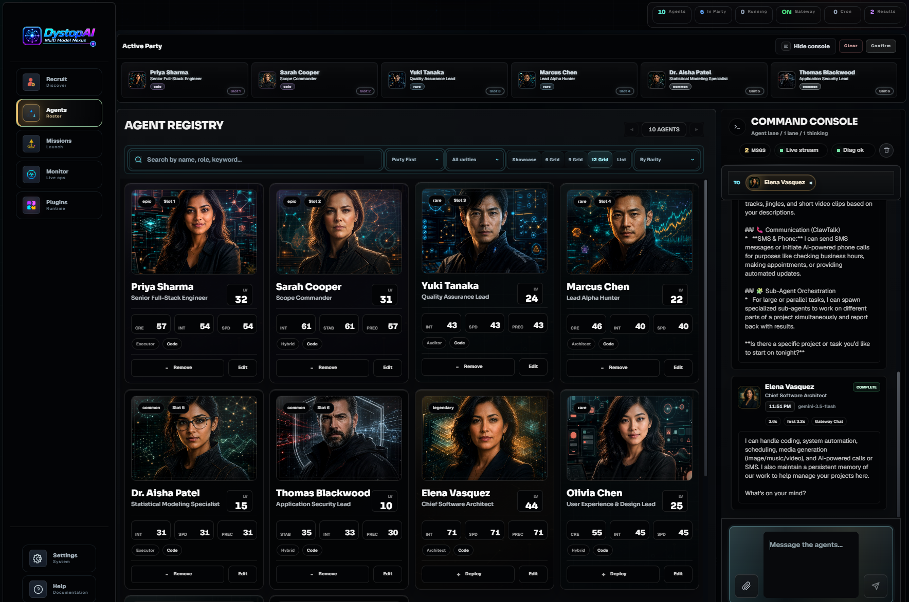
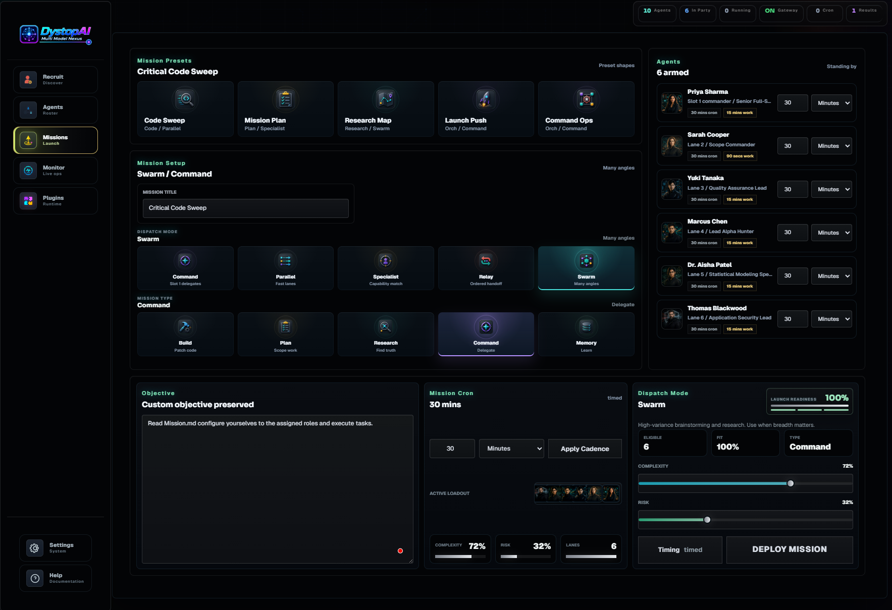
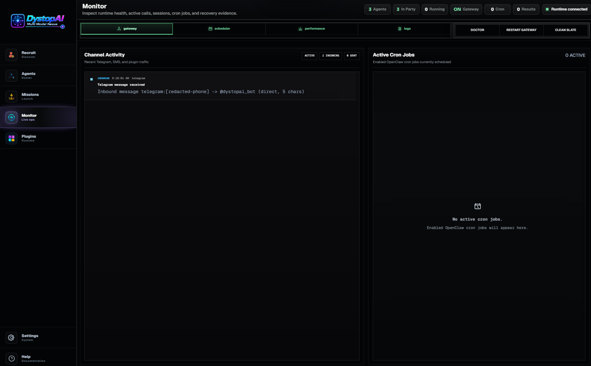
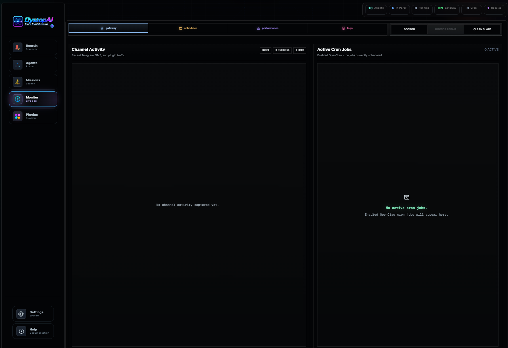
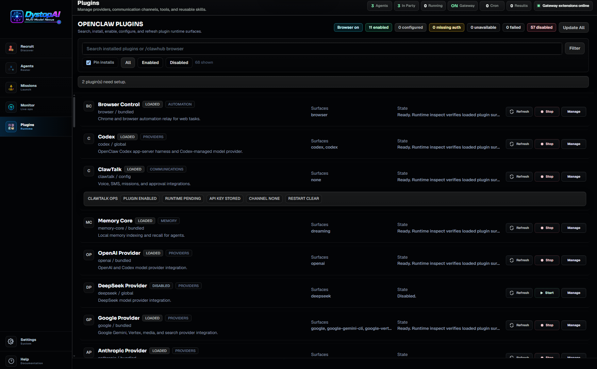
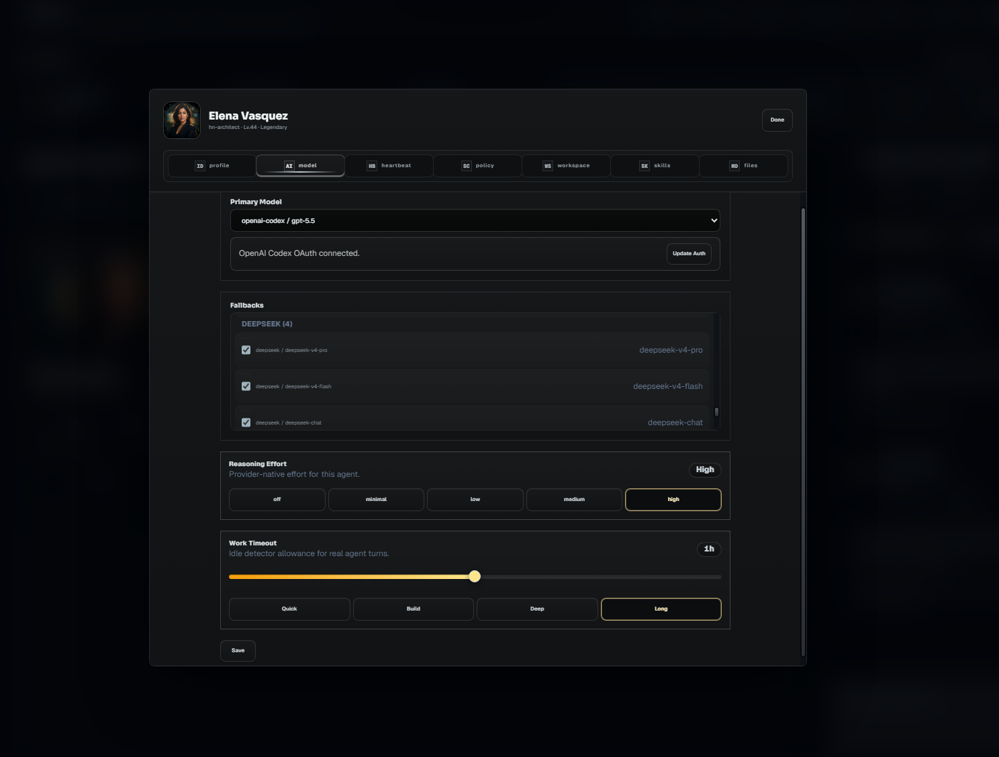
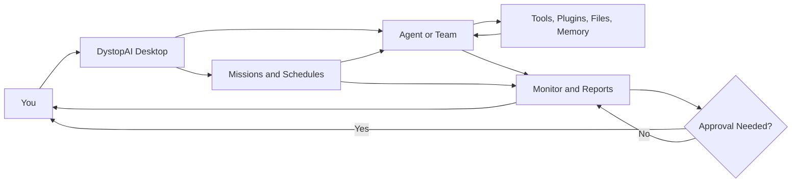

<div align='center'>


# DystopAI

### A local-first AI command center for agents, missions, schedules, plugins, and live runtime control

DystopAI is a standalone desktop app for building specialized OpenClaw agents, giving them tools and workspaces, sending them work, scheduling repeatable missions, watching what they do, and keeping high-impact actions behind approval.

**Multi Model Nexus** · **Local-first** · **Custom agents** · **Scheduled missions** · **Plugin-powered workflows** · **Visible runtime** · **Human approval**

</div>

<p align='center'>
  
</p>

> [!IMPORTANT]
> DystopAI can connect agents to real files, tools, model providers, browsers, plugins, and communication channels. Keep the Control Center and Gateway local to your machine. Use approval gates for actions that send messages, delete files, make purchases, deploy code, push to GitHub, change accounts, or affect other people.

## The Plain-English Version

DystopAI turns AI from one generic chat box into a small local operations desk:

```text
Build agents.
Give them tools.
Assign work.
Schedule missions.
Watch the runtime.
Approve what matters.
Read the report.
```

Each agent can have its own role, model, personality, memory, workspace, tools, schedule, and rules. You can talk to one specialist, deploy a small team, or launch a mission where agents divide work and return a clear proof-oriented report.

## Start Here

### Choose Your Path

| I want to use it | I want to run from source | I want to audit or release it |
| --- | --- | --- |
| Use a signed Windows installer from [GitHub Releases](https://github.com/hotboysupreme12-hash/DystopAI-Core/releases) when a qualified public or beta build is published. | Clone the repo, install dependencies, and launch the desktop shell with `npm run desktop`. | Read the release governance, data handling, security policy, and production release runbook before distributing builds. |

> [!NOTE]
> DystopAI Core is currently a private beta style local desktop project. The primary packaged beta path is Windows 11 x64, with Windows 10 22H2 x64 best effort. macOS and Linux source validation are available for developers, but packaged public builds should be treated as release-candidate work until the release runbook is satisfied.

### First Useful Win In Five Minutes

1. Open DystopAI.
2. Connect one model provider or OAuth account.
3. Select an existing agent or recruit one focused helper.
4. Pick a workspace only if the task needs files.
5. Send a small direct Command Console prompt.
6. Open Monitor and confirm the Gateway, run, session, logs, and result.
7. Launch a mission only after a small direct prompt works.
8. Add plugins and channels after the basic agent path is healthy.

A good first prompt:

```text
Review this project folder at a high level. Tell me what you inspected, what looks risky, and what one next step you recommend.
```

A weak first prompt:

```text
Fix everything.
```

## What DystopAI Can Do

| Capability | What that means in normal language |
| --- | --- |
| **Create specialized agents** | Make helpers for coding, research, planning, support, writing, review, operations, or custom workflows. |
| **Use multiple model lanes** | Give different agents different providers, models, fallbacks, thinking settings, and timeouts. |
| **Work inside approved folders** | Let an agent inspect or work inside a chosen workspace instead of handing the whole machine to one chat. |
| **Launch missions** | Turn an objective into structured work with agents, timing, risk, acceptance criteria, and reports. |
| **Schedule recurring work** | Run hourly, daily, weekly, looped, cron-style, or watch-style jobs when configured. |
| **Use plugins and channels** | Add model providers, tools, memory, browser flows, skills, communication channels, and service integrations. |
| **Watch live runtime state** | Monitor running agents, Gateway health, sessions, cron jobs, plugin activity, channel traffic, logs, failures, and recovery actions. |
| **Require approval** | Let agents draft, prepare, and explain before you approve external or destructive actions. |
| **Report with proof** | Return what happened, what failed, what changed, and what evidence was collected. |

Available actions depend on the models, plugins, credentials, workspaces, and permissions you configure.

## Example Agents You Can Build

| Agent type | Useful for |
| --- | --- |
| **Personal Operator** | Reminders, errands, weekly planning, summaries, household routines, and life admin. |
| **Code Builder** | Implementing focused code changes inside an approved project folder. |
| **Code Reviewer** | Checking bugs, risks, regressions, file changes, and release readiness. |
| **Research Analyst** | Comparing tools, products, markets, competitors, docs, and open questions. |
| **Business Watcher** | Monitoring products, prices, inventory, releases, support queues, or system signals. |
| **Content Producer** | Drafting outlines, scripts, posts, publishing plans, descriptions, and repurposed content. |
| **Support Agent** | Drafting replies and organizing customer or team communication. |
| **Commander** | Delegating work to other agents and turning the results into one final report. |

You are not locked into these. The point is to build the exact helper you need: strict, creative, fast, cautious, technical, friendly, research-heavy, or approval-first.

## Trust And Permissions

DystopAI is powerful because it can control real workflows. Treat it like an operator console, not a toy chat window.

### What Stays Local By Default

By default:

- DystopAI desktop state lives in `~/.dystopai-control-center`.
- OpenClaw runtime state lives in `~/.openclaw`.
- Agent workspaces stay in folders you choose.
- Agent configuration, doctrine files, mission history, local runtime ledgers, provider auth material, plugin configuration, and local sessions stay on your machine.
- DystopAI does not require a DystopAI cloud telemetry service for local operation.

### What Can Leave Your Machine

Data can leave your machine when you enable or use anything that reaches an external service:

- Model providers can receive prompts, instructions, attachments, tool results, and conversation context.
- Plugins and channels can send messages, files, metadata, replies, or webhook payloads through outside services.
- Browser tools can send requests to visited websites.
- Diagnostic or feedback reports leave your machine when you choose to submit them.
- Providers, websites, operating-system services, and communication platforms may keep their own logs under their own terms.

### The Safe Operating Rule

Keep approval gates on for:

- purchases;
- file deletion or large file changes;
- deployments;
- GitHub pushes;
- outbound messages to other people;
- account or credential changes;
- browser actions with money, identity, or irreversible effects.

### Do Not Expose The Local API

DystopAI is designed for one trusted local operator boundary. Keep these surfaces on loopback:

```text
Control Plane API: 127.0.0.1:4050
Development frontend: 127.0.0.1:5173
OpenClaw Gateway: 127.0.0.1:18789
```

Do not bind them to `0.0.0.0`, port-forward them, tunnel them to strangers, or treat the local bearer token like an internet account system. Remote operation should go through supported channel plugins with explicit credentials, scoped access, and approvals.

## Proof Gallery: Workflows To Try

These are the fastest ways to prove the app is doing real work instead of just showing a pretty dashboard.

| Demo | What to do | Proof to look for |
| --- | --- | --- |
| **One-agent command** | Pick one agent and send a small Command Console prompt. | Monitor shows Gateway state, active run/session evidence, logs, and final result. |
| **Code review mission** | Launch a review mission with a clear objective and verification command. | Mission report lists inspected files, findings, failures, and evidence. |
| **Recurring watcher** | Schedule a simple recurring or watch-style mission. | Monitor shows cron/scheduler state and later mission events. |
| **Plugin setup** | Enable one provider or channel plugin and send a tiny test command. | Plugins show setup/runtime status, and Monitor shows channel or Gateway activity. |
| **Recovery path** | Stop or reset Gateway after checking active work. | Monitor shows recovery evidence, updated health, and clean logs. |

## Missions: Turn A Goal Into Work

A mission turns a request into structured work:

```text
Goal
+ selected agents
+ timing
+ tools
+ rules
+ approval gates
+ final report
= controlled AI work
```

Examples:

| Goal | Example request |
| --- | --- |
| **Software delivery** | Launch a Build mission with an architect, builder, and reviewer. Require lint, typecheck, and a changed-file report. |
| **Research** | Compare these products, separate facts from assumptions, and return the best option with open questions. |
| **Business monitoring** | Watch these product pages and alert me only when price, inventory, or release status changes. |
| **Personal routine** | Every Friday, prepare next week's grocery list from my meal plan and send it for approval. |
| **Customer response** | Draft the customer reply, wait for approval, then send through the connected channel if configured. |
| **Emergency stop** | Stop all active runs and tell me what was interrupted. |

Missions can be immediate, timed, looped, recurring, or watch-style. They can use one agent or a team.

## Plugins And Channels

Plugins are how agents gain extra powers.

| Plugin power | What it enables |
| --- | --- |
| **Communication** | Let agents receive and reply through compatible SMS, voice, team chat, web chat, webhook, or future channel plugins. |
| **Model access** | Let different agents use different models and fallbacks. |
| **Browser and tools** | Let agents inspect pages, gather context, or use approved tool flows. |
| **Memory and skills** | Give agents reusable knowledge, procedures, and playbooks. |
| **Service connections** | Connect agents to outside systems when credentials and permissions are configured. |

DystopAI starts as a desktop app. Compatible plugins can make agents reachable through other channels.

Example commands:

```text
@Diana summarize the overnight alerts
@hn-builder inspect the failed build and report the first blocker
@Commander stop the active mission and return current evidence
```

A command can come from the desktop, local web, or a configured channel. DystopAI routes it to the right agent, runs the work, watches the result, and keeps important actions behind approval.

## Monitor: See What The Agents Are Doing

Monitor exists for one reason:

> **You should never have to guess what the system is doing.**

Use Monitor to see:

- which agents are running;
- which missions are scheduled;
- which channel messages arrived or failed;
- which plugins need setup;
- which sessions are open;
- which jobs failed, retried, or completed;
- which work needs approval;
- when to stop, restart, clean up, or recover a stuck run.

### Plain-English Recovery Labels

The app may use technical names, but the operating idea is simple:

| User-facing idea | Technical surface |
| --- | --- |
| **Soft Refresh** | Clean Slate clears stale monitor cache, completed runtime calls, log tail snapshots, and stale session locks while preserving healthy active work. |
| **Restart Engine** | Reset Gateway restarts Gateway-backed runtime services. |
| **Stop Engine** | Stop Gateway turns off Gateway listeners and plugin/channel services until restarted. |
| **Doctor Check** | Doctor runs diagnostics and offers repair recommendations. |

Start with the least destructive fix. Check active work before stopping or resetting Gateway.

## Why It Feels Simple

DystopAI keeps the mental model small. You do not have to think in backend parts first. You think in plain questions:

| Plain question | DystopAI answer |
| --- | --- |
| **Who should do this?** | Pick one agent or a team. |
| **What should they do?** | Send a command or launch a mission. |
| **When should it happen?** | Run it now, schedule it, loop it, or watch for changes. |
| **What powers can they use?** | Choose tools, plugins, channels, models, memory, and workspaces. |
| **Can I trust the result?** | Watch the work, require approval, and read the final report. |

That is the English version of the system: agents do jobs, plugins give them powers, missions give them structure, schedules give them timing, and Monitor keeps the whole thing visible.

## Why It Feels Robust

Simple does not mean shallow. DystopAI is built to make agent work easier to trust:

- **Local by default:** app state, agent files, workspaces, mission history, and runtime state stay on your machine unless you connect an outside provider or plugin.
- **Separate agent lanes:** each helper can have its own job, model, workspace, tools, schedule, and rules, so work does not collapse into one tangled chat thread.
- **Visible work:** Monitor shows running agents, scheduled jobs, channel activity, plugin status, failures, and recovery actions.
- **Real schedules:** recurring and watch-style jobs are tracked as real runs, not just a timer painted on the screen.
- **Approval before impact:** agents can draft, prepare, and explain before you let them send, change, delete, purchase, publish, or push.
- **Recovery controls:** stop controls, session cleanup, Gateway restart, and Clean Slate recovery give you a way back when something gets stuck.
- **Proof-oriented reports:** important missions can return what happened, what failed, what changed, and what still needs attention.

## Showcase

The screenshots below reflect the refreshed dark control-center UI captured on June 29, 2026.

| Agents | Missions |
| --- | --- |
|  |  |

| Runtime Monitor | Quiet Monitor |
| --- | --- |
|  |  |

<details>
<summary>View plugin runtime screenshot</summary>



</details>

<details>
<summary>View agent settings screenshot</summary>



</details>

## Main Screens

- **Recruit:** create a new agent with a role, model lane, workspace, and starter behavior.
- **Agents:** browse your roster, deploy an active party, edit specialists, and send live commands.
- **Command Console:** talk to one agent, selected agents, or the active party while keeping the conversation readable.
- **Missions:** turn goals into structured work with agents, timing, rules, approval needs, and reports.
- **Plugins:** add channels, model providers, tools, memory, skills, and service integrations.
- **Monitor:** see running work, schedules, sessions, channel traffic, failures, and recovery controls.
- **Agent Editor:** tune each agent's model, authentication, workspace, tools, skills, schedule, and behavior files.

## How The Pieces Fit Together

The graph below is the simple version. You give the order, DystopAI routes it to agents, plugins and workspaces supply the powers, Monitor shows the run, and approvals keep important steps with you.



## How A Request Moves Through DystopAI

```text
You ask for something.
DystopAI sends it to the right agent or team.
The agent uses the allowed tools, files, memory, and plugins.
The mission or schedule keeps the work organized.
Monitor shows what is happening.
The agent returns a result with evidence.
You approve anything important before it happens.
```

That is the whole loop: **ask, assign, work, watch, report, approve.**

## Install From Source

Use this when you are developing, auditing, or running before a packaged installer is available.

### Prerequisites

- Node.js `24` recommended, or Node.js `22.19+` for compatibility.
- npm.
- Git.
- Model provider credentials or OAuth access.
- Credentials for any plugin or communication channel you enable.

### Install

```bash
git clone https://github.com/hotboysupreme12-hash/DystopAI-Core.git
cd DystopAI-Core
npm ci
```

### Launch The Desktop App

```bash
npm run desktop
```

This builds the app, prepares the bundled OpenClaw runtime, and launches DystopAI.

### Development Mode

```bash
npm run dev
```

Development defaults:

- Frontend: `http://127.0.0.1:5173/`
- Local API: `http://127.0.0.1:4050/`
- OpenClaw Gateway: `127.0.0.1:18789`

When `CONTROL_CENTER_TOKEN` is not configured, the development server generates a local session token and reports it in the startup log. The desktop app keeps its launch token in a local user token file instead, so packaged Windows sessions can survive restarts without exposing the long-lived token to the web page.

## Essential Commands

Most users start with just these:

| Command | Purpose |
| --- | --- |
| `npm run dev` | Start the backend and frontend together for development. |
| `npm run desktop` | Build and launch the desktop app. |
| `npm run build:standalone` | Build the production frontend and server bundle. |
| `npm test` | Run the full local quality gate. |

For deeper validation, packaging, and release work:

| Command | Purpose |
| --- | --- |
| `npm run lint` | Run ESLint across source, server, scripts, and tests. |
| `npm run typecheck` | Type-check frontend, server, Electron, and preload surfaces. |
| `npm run smoke:ui` | Verify the production UI render path. |
| `npm run smoke:openclaw` | Verify Gateway, diagnostics, streaming, and agent-turn contracts. |
| `npm run check:bundle-budgets` | Enforce production renderer bundle budgets. |
| `npm run package:desktop` | Create an unpacked desktop package for launch validation. |
| `npm run dist:win` | Create a Windows installer. |
| `npm run dist:mac` | Create a macOS package. |
| `npm run dist:linux` | Create Linux AppImage and Debian outputs. |
| `npm run verify:release-candidate` | Run the release-candidate test, build, budget, and Electron gates. |
| `npm run state:backup` | Create a runtime-state backup. |
| `npm run state:verify` | Verify a runtime-state backup. |
| `npm run state:restore` | Restore a runtime-state backup. |
| `npm run docs:openclaw:sync` | Refresh the local OpenClaw documentation snapshot. |

## Configuration

Most users need two things first: model access and plugin credentials. Advanced local settings are available when you need to change ports, state folders, or runtime paths.

| Variable | Default | Purpose |
| --- | --- | --- |
| `CONTROL_CENTER_PORT` | `4050` | Local API and packaged app port. |
| `CONTROL_CENTER_FRONTEND_PORT` | `5173` | Development frontend port. |
| `CONTROL_CENTER_TOKEN` | Generated or loaded locally when unset | Local browser/session bootstrap token. |
| `CONTROL_CENTER_WORKSPACE_ROOT` | Project or OpenClaw workspace | Root workspace exposed through the local app. |
| `OPENCLAW_GATEWAY_PORT` | `18789` | OpenClaw Gateway port. |
| `OPENCLAW_BROWSER_RELAY_PORT` | `18792` | Browser relay port. |
| `OPENCLAW_STATE_DIR` / `OPENCLAW_HOME` | User OpenClaw state directory | Runtime state, agents, skills, sessions, and configuration. |
| `OPENCLAW_CONFIG_PATH` | `<state>/openclaw.json` | Active OpenClaw configuration file. |
| `DYSTOPAI_USER_DATA_DIR` | `~/.dystopai-control-center` | Desktop app user data directory. |
| `DYSTOPAI_CONTROL_CENTER_TOKEN_FILE` | `<user data>/auth/control-center-token.json` | Advanced override for the desktop token file path. |

Keep provider keys, OAuth credentials, channel credentials, local sessions, generated runtime data, signing keys, and release output outside version control.

On Windows first run, the desktop app creates `%USERPROFILE%\.dystopai-control-center\auth\control-center-token.json`. To set your own persistent local token, close DystopAI, edit the `token` field to a long random value with no line breaks, then reopen the app. If the file is deleted, blank, or malformed, DystopAI moves the bad file aside when possible and creates a fresh local token so the desktop app does not lock you out.

## Beta And Release Status

Current package version: `0.0.6`.

DystopAI Core is an active local-first desktop project built around the OpenClaw runtime. The principal product surfaces are implemented: agent recruitment and configuration, active-party control, live chat, structured missions, cron-backed recurring work, runtime monitoring, plugin and skill management, provider authentication, channel activity, recovery controls, packaging, and release evidence.

Best fit right now:

- builders and technical users;
- local automation testers;
- agent workflow experimenters;
- people comfortable with providers, plugins, runtime logs, and beta recovery.

Not yet the right fit for:

- unattended business-critical automation;
- hostile multi-user or network-hosted deployments;
- public internet exposure of the local API or Gateway;
- nontechnical users who need a no-questions, one-click consumer support path.

Public release candidates should be qualified from the exact bytes that will be distributed.

```bash
npm run verify:release-candidate
npm run dist:win
npm run release:update-manifest
npm run release:update-verify
npm run release:lifecycle:windows
npm run release:evidence
DYSTOPAI_RELEASE_SIGNING_PRIVATE_KEY_FILE=C:/secure/dystopai-release-ed25519.pem npm run release:sign
DYSTOPAI_RELEASE_REQUIRE_SIGNING=1 npm run release:validate
```

The release flow can record artifact size, SHA-256 digest, update metadata, signing evidence, install and uninstall validation, rollback continuity, and distribution evidence. Public release validation expects consumer distribution signing evidence in `release/evidence/distribution-signing.json` before `npm run release:evidence`. Private signing keys must never be committed.

## Documentation

- [`docs/USER_GUIDE.md`](docs/USER_GUIDE.md): walkthrough for agents, missions, monitoring, plugins, ClawTalk, and model authentication.
- [`docs/BETA_SUPPORT.md`](docs/BETA_SUPPORT.md): private beta disclaimer, known issues, Gateway recovery, local state reset, safe logs, data boundaries, supported OS, and feedback link.
- [`docs/OPENCLAW_GATEWAY_COMMAND_CONSOLE_GUIDE.md`](docs/OPENCLAW_GATEWAY_COMMAND_CONSOLE_GUIDE.md): Gateway protocol and Command Console integration.
- [`docs/PRODUCTION_RELEASE_RUNBOOK.md`](docs/PRODUCTION_RELEASE_RUNBOOK.md): signed Windows qualification and publication sequence.
- [`docs/RELEASE_GOVERNANCE.md`](docs/RELEASE_GOVERNANCE.md): CI, signing, evidence, release, and threat-model policy.
- [`docs/PRODUCTION_HARDENING_LEDGER.md`](docs/PRODUCTION_HARDENING_LEDGER.md): production-readiness ledger and engineering backlog.
- [`DATA_HANDLING.md`](DATA_HANDLING.md): local state, providers, telemetry, channels, and operator data boundaries.
- [`SECURITY.md`](SECURITY.md): vulnerability reporting and the local operator security boundary.
- [`THIRD_PARTY_NOTICES.txt`](THIRD_PARTY_NOTICES.txt): generated dependency and license inventory.
- [`docs/openclaw-latest/`](docs/openclaw-latest/): local OpenClaw documentation snapshot used by the project.

## The Product Direction

DystopAI is bigger than any single chat surface:

> **Build agents. Give them tools. Schedule missions. Watch the work. Approve what matters.**
