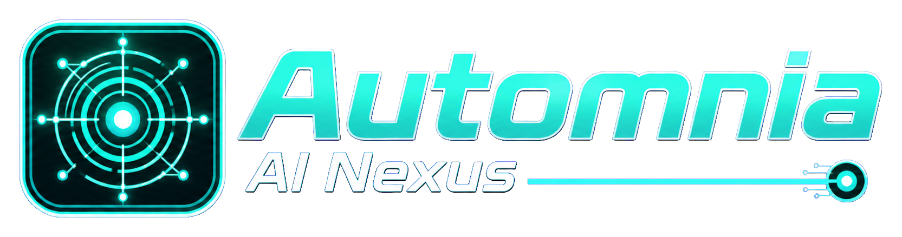
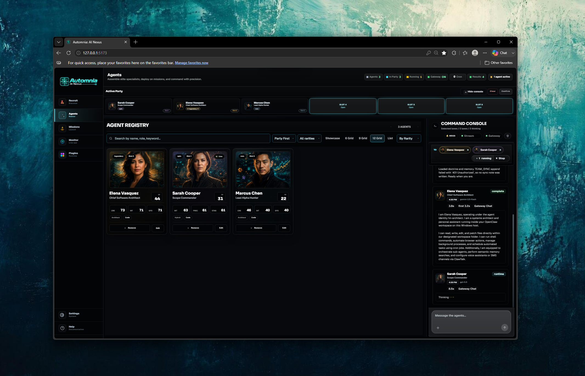
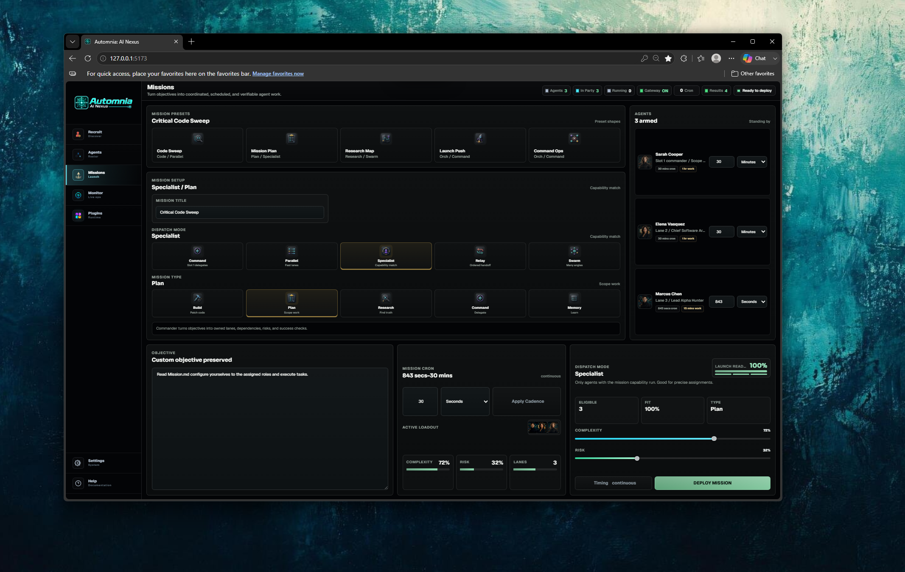
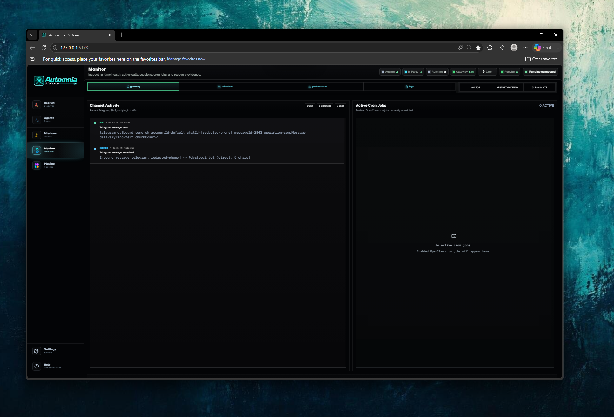
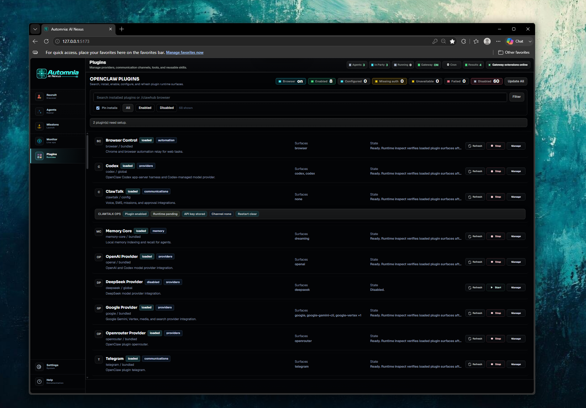
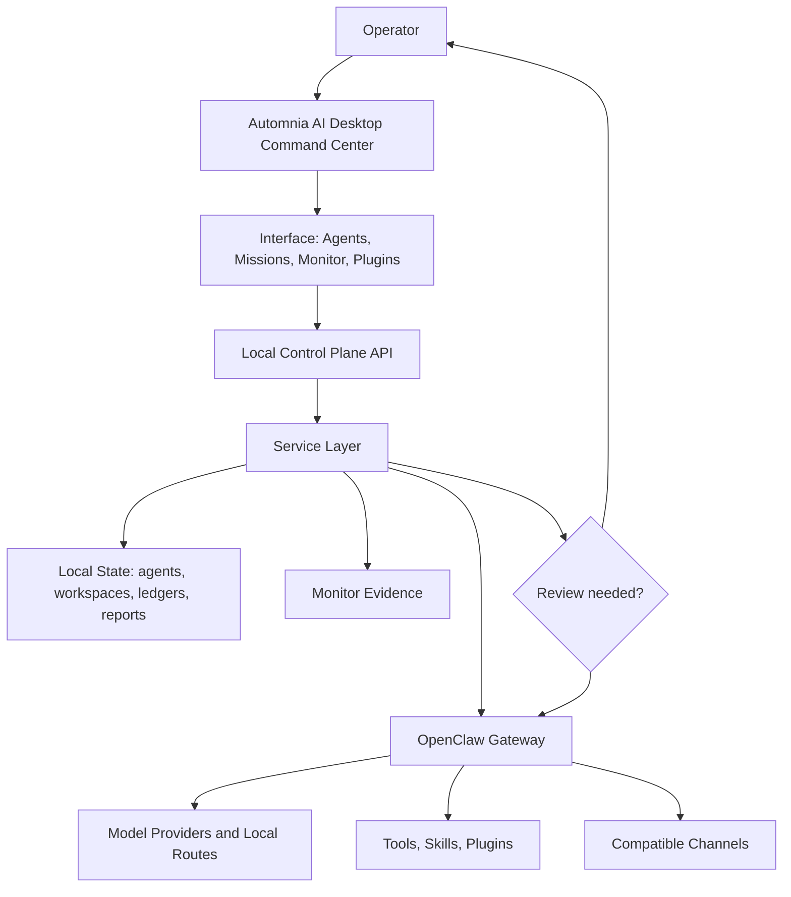

<div align="center">



# Automnia AI

### A local AI operations nexus for configurable agents, missions, schedules, plugins, channels, and live runtime visibility

Automnia AI lets you run powerful agents like a local operations team. Use one flexible agent for broad help, build a specialist for every task, or combine both into focused workflows with clear roles, tools, workspaces, schedules, memory, plugins, channels, and approval rules.

**AI Nexus** · **Custom agents** · **Missions** · **Schedules** · **Plugins** · **Runtime monitor** · **Approval-first automation** · **Local-first control**

[Assistant Operations Manual](docs/AUTOMNIA_ASSISTANT_OPERATIONS_MANUAL.md) · [User Guide](docs/USER_GUIDE.md) · [UI Reference](docs/AUTOMNIA_UI_REFERENCE.md) · [Support Guide](docs/BETA_SUPPORT.md) · [Release Notes](docs/BETA_RELEASE_NOTES.md) · [CI Evidence](docs/CI_EVIDENCE.md) · [Data Handling](DATA_HANDLING.md) · [Security](SECURITY.md) · [Release Governance](docs/RELEASE_GOVERNANCE.md)

</div>

## What is Automnia AI?

Automnia AI is a desktop command center for agent work. It connects the simple idea of asking an assistant for help with the deeper structure needed for repeatable, visible, recoverable automation.

You can keep it simple:

```text
Launch App.
Create an agent.
Select Model.
Send a task.
Watch what happens.
Approve important actions.
Read the result.
```

Or you can build a small operating team:

```text
Recruit specialists.
Assign workspaces and tools.
Connect model routes and plugins.
Schedule recurring missions.
Send updates through compatible channels.
Use Monitor as the truth window.
```

The freedom is the point. One agent can handle many everyday tasks, while specialized agents can own precise lanes like code review, research, customer replies, store operations, content planning, or scheduled monitoring.

The Command Console also supports one-tap dictation beside the Send button, with a microphone-level waveform while speaking. Voice input stops automatically after a short pause (or when the microphone is tapped again). Local mode prewarms a compact speech model, filters silent captures, and runs recognition on the device after a one-time model download; Settings → Voice transcription can switch between Local and Cloud (OpenAI) processing.

## How it feels in plain English

| Typical assistant app | Automnia AI |
| --- | --- |
| One long chat thread | A visual AI operations nexus with extensive model support, identity, missions, schedules, skills, plugins, and runtime evidence |
| One personality | One general operator, many specialists, or both |
| Hidden background work | Monitor views for Gateway health, sessions, logs, cron jobs, failures, and recovery |
| Manual repetition | Repeatable missions and scheduled workflows |
| Loose prompts | Agents with roles, workspaces, tools, doctrine, model lanes, and rules |
| Blind automation | Review gates for important actions |

## Interface showcase

<div align="center">
  
</div>

<br />

<table>
  <tr>
    <td width="33%"></td>
    <td width="33%"></td>
    <td width="33%"></td>
  </tr>
  <tr>
    <td align="center"><strong>Mission Control</strong></td>
    <td align="center"><strong>Monitor</strong></td>
    <td align="center"><strong>Plugins</strong></td>
  </tr>
</table>

## Example workflows

| Workflow | What the agents handle |
| --- | --- |
| **Code crew** | Architect, builder, reviewer, tester, and release-check agents working inside an approved repo. |
| **Customer support desk** | Review incoming messages, prepare replies, organize context, and route follow-ups through configured tools. |
| **Store operator** | Inspect inventory, orders, website data, SEO tasks, product details, and promotion ideas through compatible store tooling. |
| **Content studio** | Plan scripts, hooks, titles, descriptions, thumbnails, launch posts, and media workflows through configured tools. |
| **Research desk** | Compare sources, separate facts from assumptions, and return a decision-ready brief. |
| **Watcher** | Check products, prices, releases, jobs, markets, alerts, or system signals on a cadence. |
| **Personal operator** | Prepare plans, reminders, drafts, notes, summaries, and routine check-ins for review. |
| **Mission control** | Turn a goal into assigned agents, timing, risk, acceptance criteria, recovery steps, and proof. |

## Agent customization

| Area | What you can tune |
| --- | --- |
| **Identity** | Name, role, description, personality, tone, and operating style. |
| **Model lane** | Primary model, fallback model, provider route, thinking level, timeout, and runtime behavior. |
| **Workspace** | A repo, docs folder, content folder, support export, store data folder, or no file access. |
| **Doctrine** | Rules, memory notes, review policy, response style, and mission instructions. |
| **Tools** | Files, browser tools, runtime actions, skills, plugins, provider routes, and compatible channel tools. |
| **Schedule** | Run now, run once later, repeat on cadence, watch for changes, or loop until stopped. |

## Architecture map



<details>
<summary><strong>How the pieces fit together</strong></summary>

| Piece | Plain meaning |
| --- | --- |
| **Desktop command center** | The local app where the operator creates agents, runs missions, checks Monitor, and manages plugins. |
| **Interface** | React, Vite, and Electron surfaces for the agent roster, mission control, monitor, settings, and plugin views. |
| **Control Plane API** | The local backend boundary for app actions, runtime status, files, provider setup, missions, and diagnostics. |
| **Service layer** | Focused backend services for Gateway lifecycle, runtime recovery, missions, providers, plugins, filesystem, browser, and agent turns. |
| **OpenClaw Gateway** | The runtime path for agent sessions, tools, plugins, compatible channels, and model/provider routes. |
| **Monitor evidence** | The operator view of what ran, what is running, what failed, what recovered, and what proof came back. |
| **Review loop** | A human review point before important actions execute. |

</details>

## Start simple

Recommended runtime: Node.js 24, or Node.js 22.19+ for compatibility. You also need npm and Git.

```bash
git clone https://github.com/hotboysupreme12-hash/Automnia-AI-Nexus.git
cd Automnia-AI-Nexus
npm ci
npm run prepare:openclaw-vendor
npm run desktop
```

For development mode, run the server and client together:

```bash
npm run dev
```

For validation before changing or packaging the app:

```bash
npm test
npm run build:standalone
```

For release evidence and signing validation:

```bash
npm run release:evidence
npm run release:sign
npm run release:validate
```

Set `AUTOMNIA_RELEASE_SIGNING_PRIVATE_KEY_FILE` or `AUTOMNIA_RELEASE_SIGNING_PRIVATE_KEY_PEM` before signing. Set `AUTOMNIA_RELEASE_REQUIRE_SIGNING=1` for mandatory public-release validation.

Public release evidence also needs `distribution-signing.json` so reviewers can verify consumer signing, update-channel signing, install, upgrade, rollback, and uninstall evidence.

For complete setup, read the [User Guide](docs/USER_GUIDE.md). For recovery and feedback details, read the [Support Guide](docs/BETA_SUPPORT.md).

## Current status

Automnia AI is stable for Windows, macOS, and Linux.

## Documentation map

| Need | Go here |
| --- | --- |
| Learn the app | [User Guide](docs/USER_GUIDE.md) |
| Get help or send feedback | [Support Guide](docs/BETA_SUPPORT.md) |
| Review release notes | [Release Notes](docs/BETA_RELEASE_NOTES.md) |
| Review hosted CI proof | [CI Evidence](docs/CI_EVIDENCE.md) |
| Understand data boundaries | [Data Handling](DATA_HANDLING.md) |
| Report security issues | [Security](SECURITY.md) |
| Review release rules | [Release Governance](docs/RELEASE_GOVERNANCE.md) |
| Deploy or migrate Automnia Cloud | [Google Cloud deployment package](infra/gcloud/README.md) |

## Product synopsis

**Automnia AI is a local AI operations nexus for building, running, scheduling, and monitoring powerful agents. It gives you the choice to run one general agent, a team of specialists, or highly focused workflows with tools, plugins, channels, memory, evidence, and human review where it matters.**
