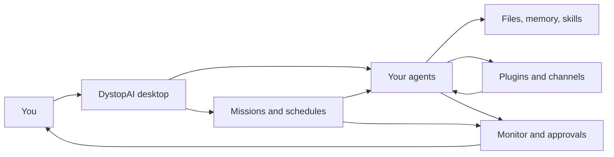

<div align='center'>


# DystopAI

### Build specialized AI agents that can work, watch, schedule, message, and report

DystopAI is a local-first desktop command center for creating AI agents, giving them tools, assigning them missions, and keeping you in control while they work.

**Multi Model Nexus** · **Local-first** · **Custom agents** · **Scheduled missions** · **Plugin-powered helpers** · **Human approval**

</div>

<p align='center'>
  
</p>

> [!IMPORTANT]
> DystopAI can connect agents to real files, tools, models, browsers, plugins, and communication channels. Keep the local control app on your machine. Use approval gates for important actions like sending messages, deleting files, making purchases, pushing code, or changing accounts.

## What Is DystopAI?

**DystopAI is a command center for your own AI workforce.**

Instead of one generic chatbot, you can create a roster of agents: builders, researchers, reviewers, analysts, assistants, coordinators, support agents, automation agents, and any custom helper your workflow needs.

Each agent can have its own role, model, personality, memory, workspace, tools, schedule, and rules. You can talk to one specialist, deploy a small team, or launch a mission where agents divide the work and return a clear report.

The goal is simple:

```text
Give the system a job.
Choose the right agents.
Let plugins give them useful powers.
Schedule work when needed.
Watch what happens.
Approve anything important.
```

## What Can Your Agents Do?

DystopAI is built around agent capability, not just chat. Your agents can become personal helpers, project workers, watchers, responders, planners, reviewers, and tool-using assistants.

| Agent capability | What that can look like |
| --- | --- |
| **Plan your day or week** | Prepare reminders, task lists, grocery lists, appointment prep, content plans, or weekly check-ins. |
| **Work inside projects** | Inspect files, summarize folders, review code, draft changes, compare versions, and report exactly what changed. |
| **Research and compare** | Gather information, compare options, separate facts from assumptions, and return a clean decision brief. |
| **Watch for changes** | Monitor products, prices, inventory, competitors, launches, logs, system health, or other signals. |
| **Draft messages** | Prepare replies, customer responses, updates, summaries, outreach, or follow-ups. |
| **Use connected channels** | Receive commands through supported channels and return answers where the request came from. |
| **Use browser and plugin tools** | Use configured tools for browsing, service access, memory, skills, files, providers, and custom workflows. |
| **Run on a schedule** | Repeat useful work hourly, daily, weekly, on a cron schedule, or in watch mode. |
| **Work as a team** | Let one agent lead while others research, build, review, test, or summarize. |
| **Ask before big moves** | Draft and prepare important actions, then wait for your approval before execution. |
| **Report with proof** | Return what was done, what failed, what needs attention, and what evidence was collected. |

Available actions depend on the models, plugins, credentials, workspaces, and permissions you configure.

## Example Agents You Can Build

| Agent type | Useful for |
| --- | --- |
| **Personal Operator** | Reminders, errands, weekly planning, summaries, household routines, and life admin. |
| **Code Builder** | Implementing focused code changes inside an approved project folder. |
| **Code Reviewer** | Checking bugs, risks, regressions, file changes, and release readiness. |
| **Research Analyst** | Comparing tools, products, markets, competitors, docs, and open questions. |
| **Business Watcher** | Monitoring products, prices, inventory, releases, support queues, or system signals. |
| **Content Producer** | Drafting outlines, scripts, posts, publishing plans, descriptions, and repurposed content. |
| **Support Agent** | Drafting replies and organizing customer or team communication. |
| **Commander** | Delegating work to other agents and turning the results into one final report. |

You are not locked into these. The point is to build the exact helper you need: strict, creative, fast, cautious, technical, friendly, research-heavy, or approval-first.

## Missions: Turn A Goal Into Work

A mission is how DystopAI turns a request into structured work.

```text
Goal
+ selected agents
+ timing
+ tools
+ rules
+ approval gates
+ final report
= controlled AI work
```

Examples:

| Goal | Example request |
| --- | --- |
| **Software delivery** | Launch a Build mission with an architect, builder, and reviewer. Require lint, typecheck, and a changed-file report. |
| **Research** | Compare these products, separate facts from assumptions, and return the best option with open questions. |
| **Business monitoring** | Watch these product pages and alert me only when price, inventory, or release status changes. |
| **Personal routine** | Every Friday, prepare next week’s grocery list from my meal plan and send it for approval. |
| **Customer response** | Draft the customer reply, wait for approval, then send through the connected channel if configured. |
| **Emergency stop** | Stop all active runs and tell me what was interrupted. |

Missions can be immediate, timed, looped, recurring, or watch-style. They can use one agent or a team.

## Plugins Make Agents More Useful

Plugins are how agents gain extra powers.

A plugin can add a communication channel, model provider, browser tool, memory system, skill library, service integration, or custom workflow. That means an agent can be more than a text box. It can become a helper with the right tools for the job.

| Plugin power | What it enables |
| --- | --- |
| **Communication** | Let agents receive and reply through compatible SMS, voice, team chat, web chat, webhook, or future channel plugins. |
| **Model access** | Let different agents use different models and fallbacks. |
| **Browser and tools** | Let agents inspect pages, gather context, or use approved tool flows. |
| **Memory and skills** | Give agents reusable knowledge, procedures, and playbooks. |
| **Service connections** | Connect agents to outside systems when credentials and permissions are configured. |

ClawTalk is one useful communication surface. The larger idea is broader: plugins can turn agents into hyper-custom helpers for your actual life, work, business, and projects.

## Channels Let Agents Meet You Where You Are

DystopAI starts as a desktop app, but compatible plugins can make agents reachable through other channels.

Examples:

```text
@Diana summarize the overnight alerts
@hn-builder inspect the failed build and report the first blocker
@Commander stop the active mission and return current evidence
```

A command can come from the desktop, local web, or a configured channel. DystopAI routes it to the right agent, runs the work, watches the result, and keeps important actions behind approval.

## Monitor: See What The Agents Are Doing

The Monitor exists for one reason:

> **You should never have to guess what the system is doing.**

Use Monitor to see:

- Which agents are running.
- Which missions are scheduled.
- Which channel messages arrived or failed.
- Which plugins need setup.
- Which sessions are open.
- Which jobs failed, retried, or completed.
- Which work needs approval.
- When to stop, restart, clean up, or recover a stuck run.

Live activity is not decoration. It is the dashboard that helps you trust, interrupt, verify, and recover agent work.

## Why It Feels Reliable Without Drowning You In Tech

DystopAI has a practical structure under the hood, but the user-facing idea is simple:

- **Your app stays local by default.** Agent files, workspaces, mission history, and runtime state live on your machine unless a configured provider or plugin sends data elsewhere.
- **Agents have lanes.** Each agent can have a role, model, workspace, tools, rules, and schedule instead of everything sharing one messy chat history.
- **Work is visible.** The Monitor shows running agents, channel activity, scheduled jobs, logs, failures, and recovery actions.
- **Schedules are real work paths.** Recurring and watch-style jobs are tracked by the runtime, not just animated on the screen.
- **Big actions can wait for approval.** Agents can draft, prepare, and explain before you allow the final step.
- **There is a way out when something gets stuck.** Stop controls, session cleanup, Gateway restart, and Clean Slate recovery help you regain control.

That is the architecture story in human terms: DystopAI gives agents useful powers, keeps their work visible, and gives you the steering wheel.

## Product Tour

| Agents | Missions |
| --- | --- |
|  |  |

| Runtime Monitor | Plugins |
| --- | --- |
|  |  |

| Agent Settings |
| --- |
|  |

## Core Product Surfaces

| Surface | What users do there |
| --- | --- |
| **Recruit** | Create a new agent profile, role, model lane, workspace, and starter behavior files. |
| **Agents** | Browse the roster, deploy the active party, edit specialists, and issue live commands. |
| **Command Console** | Talk to one agent, selected agents, or the confirmed party, attach files, stream output, and stop active work. |
| **Missions** | Define goals, timing, agents, risk level, approval needs, verification, and reports. |
| **Monitor** | Watch running work, sessions, schedules, channel traffic, plugin state, failures, and recovery controls. |
| **Plugins** | Manage providers, tools, communication channels, setup flows, skills, memory, and integrations. |
| **Agent Editor** | Configure models, authentication, workspaces, runtime policy, tools, skills, schedule, and behavior files. |

## How The Pieces Fit Together

The full system has several parts, but each one has a plain job:



The desktop app is the control surface. Agents do the work. Plugins expand what they can touch. Missions and schedules give them timing. Monitor shows what happened. Approval gates keep important decisions with you.

## Start Here

### Prerequisites

- Node.js `24` recommended, or Node.js `22.19+` for compatibility.
- npm.
- Git.
- Model provider credentials or OAuth access.
- Credentials for any plugin or communication channel you enable.

### Install

```bash
git clone https://github.com/hotboysupreme12-hash/DystopAI-Core.git
cd DystopAI-Core
npm ci
```

### Launch The Desktop App

```bash
npm run desktop
```

This builds the app, prepares the bundled OpenClaw runtime, and launches DystopAI.

### Launch Development Mode

```bash
npm run dev
```

Development defaults:

- Frontend: `http://127.0.0.1:5173/`
- Local API: `http://127.0.0.1:4050/`
- OpenClaw Gateway: `127.0.0.1:18789`

When `CONTROL_CENTER_TOKEN` is not configured, the server generates a local session token and reports it in the startup log.

### First Five Minutes

1. Open DystopAI.
2. Connect a model provider or OAuth account.
3. Recruit an agent or select an existing specialist.
4. Deploy agents to the active party and confirm it.
5. Send a direct command or launch a mission.
6. Open Monitor to watch runtime, sessions, schedules, channels, and evidence.
7. Add plugins after the basic agent path works.
8. Put approval gates in front of high-impact workflows.

## Essential Commands

Most users start with just these:

| Command | Purpose |
| --- | --- |
| `npm run dev` | Start the backend and frontend together for development. |
| `npm run desktop` | Build and launch the desktop app. |
| `npm run build:standalone` | Build the production frontend and server bundle. |
| `npm test` | Run the full local quality gate. |

For deeper validation, packaging, and release work:

| Command | Purpose |
| --- | --- |
| `npm run lint` | Run ESLint across source, server, scripts, and tests. |
| `npm run typecheck` | Type-check frontend, server, Electron, and preload surfaces. |
| `npm run smoke:ui` | Verify the production UI render path. |
| `npm run smoke:openclaw` | Verify Gateway, diagnostics, streaming, and agent-turn contracts. |
| `npm run check:bundle-budgets` | Enforce production renderer bundle budgets. |
| `npm run package:desktop` | Create an unpacked desktop package for launch validation. |
| `npm run dist:win` | Create a Windows installer. |
| `npm run dist:mac` | Create a macOS package. |
| `npm run dist:linux` | Create Linux AppImage and Debian outputs. |
| `npm run verify:release-candidate` | Run the release-candidate test, build, budget, and Electron gates. |
| `npm run state:backup` | Create a runtime-state backup. |
| `npm run state:verify` | Verify a runtime-state backup. |
| `npm run state:restore` | Restore a runtime-state backup. |
| `npm run docs:openclaw:sync` | Refresh the local OpenClaw documentation snapshot. |

## Configuration

Most users need two things first: model access and plugin credentials. Advanced local settings are available when you need to change ports, state folders, or runtime paths.

| Variable | Default | Purpose |
| --- | --- | --- |
| `CONTROL_CENTER_PORT` | `4050` | Local API and packaged app port. |
| `CONTROL_CENTER_FRONTEND_PORT` | `5173` | Development frontend port. |
| `CONTROL_CENTER_TOKEN` | Generated when unset | Local browser session bootstrap token. |
| `CONTROL_CENTER_WORKSPACE_ROOT` | Project or OpenClaw workspace | Root workspace exposed through the local app. |
| `OPENCLAW_GATEWAY_PORT` | `18789` | OpenClaw Gateway port. |
| `OPENCLAW_BROWSER_RELAY_PORT` | `18792` | Browser relay port. |
| `OPENCLAW_STATE_DIR` / `OPENCLAW_HOME` | User OpenClaw state directory | Runtime state, agents, skills, sessions, and configuration. |
| `OPENCLAW_CONFIG_PATH` | `<state>/openclaw.json` | Active OpenClaw configuration file. |
| `DYSTOPAI_USER_DATA_DIR` | `~/.dystopai-control-center` | Desktop app user data directory. |

Keep provider keys, OAuth credentials, channel credentials, local sessions, generated runtime data, signing keys, and release output outside version control.

## Local Data And Safety

DystopAI is built around local control.

By default:

- DystopAI desktop state lives in `~/.dystopai-control-center`.
- OpenClaw state lives in `~/.openclaw`.
- Agent workspaces remain in folders you choose.
- Agent behavior files, mission history, local auth material, and runtime state stay on your machine.
- DystopAI does not require a DystopAI cloud telemetry service.

Data can still leave your machine when you configure a model provider, plugin, channel, browser action, or tool that sends it elsewhere. Those external services keep their own privacy, auth, logging, and network boundaries.

See [`DATA_HANDLING.md`](DATA_HANDLING.md) before enabling networked tools or sharing diagnostics.

## Security And Control Notes

DystopAI is powerful because it can connect agents to real files, tools, models, channels, and plugins. Treat it like an admin console for your agent workspace.

The current safety model focuses on local operation, bounded access, and visible control:

- The local API is intended to bind only to loopback addresses.
- Browser access requires a local session token and local-origin validation.
- Browser sessions are expiring, bounded, and revocable.
- The desktop shell uses a hardened renderer boundary and narrow preload bridge.
- Agent file, shell, browser, communication, and provider access are governed by workspace, sandbox, and tool policy.
- High-impact actions should use approval boundaries and least-privilege tools.
- Exposing the local API to a LAN or the public internet is outside the current threat model.

See [`docs/RELEASE_GOVERNANCE.md`](docs/RELEASE_GOVERNANCE.md) and [`DATA_HANDLING.md`](DATA_HANDLING.md) for the detailed trust boundary.

## Release Confidence

DystopAI treats release work as evidence, not vibes.

Public release candidates should be qualified from the exact bytes that will be distributed.

```bash
npm run verify:release-candidate
npm run dist:win
npm run release:update-manifest
npm run release:update-verify
npm run release:lifecycle:windows
npm run release:evidence
DYSTOPAI_RELEASE_SIGNING_PRIVATE_KEY_FILE=C:/secure/dystopai-release-ed25519.pem npm run release:sign
DYSTOPAI_RELEASE_REQUIRE_SIGNING=1 npm run release:validate
```

The release flow can record artifact size, SHA-256 digest, update metadata, signing evidence, install and uninstall validation, rollback continuity, and distribution evidence. Private signing keys must never be committed.

## Documentation

- [`docs/USER_GUIDE.md`](docs/USER_GUIDE.md): walkthrough for agents, missions, monitoring, plugins, ClawTalk, and model authentication.
- [`docs/OPENCLAW_GATEWAY_COMMAND_CONSOLE_GUIDE.md`](docs/OPENCLAW_GATEWAY_COMMAND_CONSOLE_GUIDE.md): Gateway protocol and Command Console integration.
- [`docs/PRODUCTION_RELEASE_RUNBOOK.md`](docs/PRODUCTION_RELEASE_RUNBOOK.md): signed Windows qualification and publication sequence.
- [`docs/RELEASE_GOVERNANCE.md`](docs/RELEASE_GOVERNANCE.md): CI, signing, evidence, release, and threat-model policy.
- [`docs/PRODUCTION_HARDENING_LEDGER.md`](docs/PRODUCTION_HARDENING_LEDGER.md): production-readiness ledger and engineering backlog.
- [`DATA_HANDLING.md`](DATA_HANDLING.md): local state, providers, telemetry, channels, and operator data boundaries.
- [`THIRD_PARTY_NOTICES.txt`](THIRD_PARTY_NOTICES.txt): generated dependency and license inventory.
- [`docs/openclaw-latest/`](docs/openclaw-latest/): local OpenClaw documentation snapshot used by the project.

## Project Status

Current package version: `0.0.6`.

DystopAI Core is an active local-first desktop project built around the OpenClaw runtime. The principal product surfaces are implemented: agent recruitment and configuration, active-party control, live chat, structured missions, cron-backed recurring work, runtime monitoring, plugin and skill management, provider authentication, channel activity, recovery controls, packaging, and release evidence.

The product direction is bigger than any single chat surface:

> **Build agents. Give them tools. Schedule missions. Watch the work. Approve what matters.**
