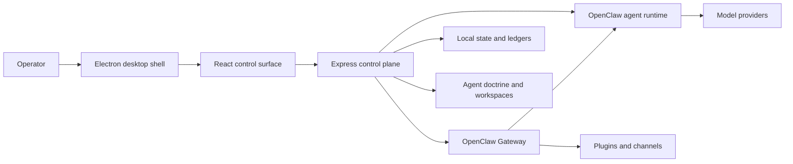

<div align="center">


# DystopAI Core

### Production-ready local command center for OpenClaw agent teams

Build agents, assemble a party, launch missions, monitor Gateway health, manage plugins, and keep multi-model AI work under operator control from one desktop app.

**Multi Model Nexus** | **Local-first desktop** | **OpenClaw Gateway** | **Plugin runtime** | **Mission control**

</div>

<p align="center">
  
</p>

> [!IMPORTANT]
> DystopAI Core is built for trusted local operators. It controls local files, tools, model access, OpenClaw Gateway sessions, plugins, and runtime state. Do not expose it as an internet-facing multi-tenant service without a separate security, authentication, authorization, transport, and audit design.

## What It Is

DystopAI Core is a desktop control plane for operating OpenClaw agent teams. It replaces scattered terminals, model tabs, cron scripts, runtime logs, and plugin commands with one focused interface for running real work.

Use it to recruit specialized agents, connect model providers, deploy an active party, send live commands, launch structured missions, inspect runtime health, manage plugins, and recover the system when something goes stale.

DystopAI is not a generic chat wrapper. It is an operations layer for turning local OpenClaw agents into an observable, configurable, and recoverable production workflow.

## Highlights

- **Agent roster:** Recruit agents with names, portraits, roles, models, tools, capability lanes, workspaces, and doctrine files.
- **Active party control:** Deploy selected agents into slots and route work to one agent, selected agents, or the whole confirmed party.
- **Command Console:** Send live prompts, stream responses, attach context, stop runs, and keep agent lanes separated.
- **Mission board:** Convert objectives into coordinated work with mission type, dispatch mode, cadence, risk, complexity, readiness, and acceptance criteria.
- **Runtime monitor:** Inspect Gateway status, active calls, cron jobs, channel traffic, logs, sessions, failures, and recovery evidence.
- **Plugin runtime:** Browse, enable, disable, update, configure, and inspect OpenClaw plugins and provider surfaces.
- **Model flexibility:** Work across OpenAI, Codex OAuth, Anthropic, Google, DeepSeek, OpenRouter, xAI, Groq, Mistral, local runtimes, and other OpenClaw-supported providers.
- **Release discipline:** Includes linting, type checks, smoke tests, release evidence, signing validation, packaging checks, and local state backup tools.

## Product Tour

| Missions | Runtime Monitor |
| --- | --- |
|  |  |

| Plugins |
| --- |
|  |

## High-Value Use Cases

- **Software delivery cockpit:** Assign architecture, implementation, QA, review, and documentation work to different agents while keeping verification visible.
- **Research operations:** Run evidence-gathering missions, preserve findings, compare model outputs, and keep acceptance criteria attached to the work.
- **AI operations center:** Monitor active runs, Gateway health, sessions, cron jobs, plugin status, and recovery actions from one screen.
- **Personal agent workforce:** Keep specialized agents ready for coding, planning, research, writing, automation, memory, and command delegation.
- **Plugin and provider lab:** Test OpenClaw provider integrations, communication channels, browser automation, memory, skills, and runtime surfaces.
- **Repeatable local automation:** Schedule recurring missions through OpenClaw cron state while retaining operator visibility and stop controls.

## Core Surfaces

### Agents

The Agents workspace is the main operating room. It combines the active party, searchable agent registry, deployment controls, and the Command Console.

Each agent can carry:

- Identity, class, role, rarity, level, portrait, and behavior profile.
- Primary model, fallback models, thinking level, timeout, and provider authentication.
- Capability lanes for code, planning, research, orchestration, memory, and runtime work.
- Workspace, sandbox, tool allow/deny policy, heartbeat cadence, and recovery mode.
- Editable doctrine files such as `IDENTITY.md`, `SOUL.md`, `BOOTSTRAP.md`, `AGENTS.md`, `USER.md`, `HEARTBEAT.md`, `MEMORY.md`, `TOOLS.md`, and `MISSION_PROMPT.md`.

### Command Console

The Command Console is the live work lane.

- Send a turn to one agent, selected agents, or the confirmed party.
- Stream responses through the OpenClaw Gateway path.
- Preserve stable session keys and recover durable final responses from Gateway history.
- Attach context and keep multi-agent traffic readable.
- Abort active turns and recover from transport failures.

### Missions

Missions turn a broad objective into coordinated, verifiable agent work.

Mission types include:

- `Build`: implementation, ownership, tests, and exact change reporting.
- `Plan`: scope, dependencies, milestones, risks, and owners.
- `Research`: source-backed findings, unknowns, constraints, and evidence.
- `Command`: delegation, handoffs, synthesis, and blocker resolution.
- `Memory`: durable notes, learned skills, and continuity updates.

Dispatch modes include `Command`, `Parallel`, `Specialist`, `Relay`, and `Swarm`. Timing modes include one-shot work, fixed cadence, repeating cron missions, and persistent watch-style missions.

### Monitor

The Monitor answers the practical operator question: what is the system doing right now?

- Gateway health, runtime status, uptime, readiness, start, stop, and restart controls.
- Active and recent calls with timing, state, failures, and recovery signals.
- Open sessions, session files, locks, stale locks, and cleanup actions.
- Channel activity, Gateway logs, diagnostic summaries, and cron jobs.
- Clean Slate recovery for stale UI and runtime state when evidence supports cleanup.

### Plugins

DystopAI exposes OpenClaw extension management without forcing operators back into manual plugin commands.

- Inspect installed, enabled, disabled, loaded, and setup-required plugins.
- Enable, disable, install, update, refresh, and configure plugin surfaces.
- Review plugin commands, providers, channels, dependencies, and runtime status.
- Work with skills, learned skills, ClawHub workflows, communication plugins, browser automation, memory, and provider integrations.

## Architecture



| Layer | Technology |
| --- | --- |
| Desktop | Electron and electron-builder |
| Frontend | React, TypeScript, Vite, Tailwind CSS, Framer Motion, and Zustand |
| Backend | Express control plane, typed route modules, Zod validation, and SSE |
| Runtime | Vendored OpenClaw runtime, Gateway sessions, cron, plugins, and skills |
| Local state | OpenClaw configuration, agent doctrine, workspaces, JSONL ledgers, and desktop user data |
| Quality gates | ESLint, TypeScript checks, unit tests, smoke tests, Electron checks, packaging checks, and release evidence validation |

## Quick Start

### Prerequisites

- Node.js `22.19+` recommended.
- npm.
- Git.
- Provider credentials or OAuth access for the models you plan to use.

### Install

```bash
git clone https://github.com/hotboysupreme12-hash/DystopAI-Core.git
cd DystopAI-Core
npm ci
```

### Run The Local Web Surfaces

```bash
npm run dev
```

Local development defaults:

- Frontend: `http://127.0.0.1:5173/`
- Control Plane API: `http://127.0.0.1:4050/`

When `CONTROL_CENTER_TOKEN` is not set, the server generates a local session token and prints it in the startup log.

### Run The Desktop App

```bash
npm run desktop
```

This builds the production frontend and server bundle, prepares the OpenClaw vendor runtime, and launches Electron.

### Build A Windows Release

```bash
npm run dist:win
```

For an unpacked local release copy:

```bash
npm run dist:win:dir
```

The unpacked app is generated under `release/win-unpacked/`. Installer and release artifacts are generated under ignored build output folders such as `release/` and `artifacts/`.

## Essential Commands

| Command | Purpose |
| --- | --- |
| `npm run dev` | Start the backend and Vite frontend together. |
| `npm run desktop` | Build and launch the Electron desktop shell. |
| `npm run build:standalone` | Build the production frontend and server bundle. |
| `npm run lint` | Run ESLint across source, server, scripts, and tests. |
| `npm run typecheck` | Type-check frontend, server, Electron, and preload surfaces. |
| `npm test` | Run the full local quality gate. |
| `npm run smoke:ui` | Verify the production UI render path. |
| `npm run smoke:openclaw` | Verify OpenClaw Gateway, diagnostics, SSE, and agent turn contracts. |
| `npm run package:desktop` | Create an unpacked desktop package for launch validation. |
| `npm run dist:win:dir` | Create an unpacked Windows desktop build. |
| `npm run dist:win` | Create the Windows installer output. |
| `npm run verify:release-candidate` | Run release-candidate tests, build checks, bundle budgets, and Electron gates. |
| `npm run docs:openclaw:sync` | Refresh the local OpenClaw documentation snapshot. |

## Release Integrity

Public release candidates should be qualified from the exact packaged bytes, not from a later rebuild.

```bash
npm run verify:release-candidate
npm run dist:win
npm run release:update-manifest
npm run release:update-verify
npm run release:lifecycle:windows
npm run release:evidence
DYSTOPAI_RELEASE_SIGNING_PRIVATE_KEY_FILE="C:/secure/dystopai-release-ed25519.pem" npm run release:sign
DYSTOPAI_RELEASE_REQUIRE_SIGNING=1 npm run release:validate
```

The release flow records artifact size, SHA-256 digest, update metadata, signing evidence, install and uninstall validation, rollback continuity, and distribution evidence. Private signing keys must never be committed.

See [`docs/PRODUCTION_RELEASE_RUNBOOK.md`](docs/PRODUCTION_RELEASE_RUNBOOK.md), [`docs/RELEASE_GOVERNANCE.md`](docs/RELEASE_GOVERNANCE.md), and [`release.env.example`](release.env.example).

## Configuration

| Variable | Default | Purpose |
| --- | --- | --- |
| `CONTROL_CENTER_PORT` | `4050` | Local Control Plane API and packaged app port. |
| `CONTROL_CENTER_FRONTEND_PORT` | `5173` | Vite development frontend port. |
| `CONTROL_CENTER_TOKEN` | Generated when unset | Local browser session token. |
| `CONTROL_CENTER_WORKSPACE_ROOT` | Project or OpenClaw workspace | Root workspace exposed through the control plane. |
| `OPENCLAW_GATEWAY_PORT` | `18789` | OpenClaw Gateway port. |
| `OPENCLAW_BROWSER_RELAY_PORT` | `18792` | Browser relay port. |
| `OPENCLAW_STATE_DIR` / `OPENCLAW_HOME` | User OpenClaw state directory | Runtime state, agents, skills, sessions, and configuration. |
| `OPENCLAW_CONFIG_PATH` | `<state>/openclaw.json` | Active OpenClaw configuration file. |
| `DYSTOPAI_USER_DATA_DIR` | `~/.dystopai-control-center` | Electron user data directory. |

Keep provider keys, OAuth credentials, local sessions, generated runtime data, and release output outside version control.

## Security Model

DystopAI controls a privileged local agent runtime. Treat it like an administrator console.

- The Control Plane API is intended to bind only to loopback addresses.
- Browser access requires a local bearer token and exact local-origin validation.
- The Electron renderer uses context isolation, sandboxing, a narrow preload bridge, restricted navigation, and denied popup creation.
- Agents may receive shell, filesystem, browser, communication, or provider tools based on operator policy.
- Broad tool or workspace access should be granted deliberately and reviewed in each agent policy and doctrine file.
- Browser session tokens expire, are bounded in memory, use session-scoped renderer storage, and are revoked server-side on logout.
- The Electron launch secret never crosses the preload bridge; the main process exchanges it for a short-lived server session token.
- OpenClaw Gateway setup is token-only by default; a password fallback is written only when explicitly supplied.
- Exposing the Control Plane to a LAN or the public internet is outside the current threat model.

The detailed threat model, branch protections, signing policy, and release requirements live in [`docs/RELEASE_GOVERNANCE.md`](docs/RELEASE_GOVERNANCE.md).

## Repository Layout

```text
.
|-- electron/                 # Electron shell and desktop process management
|-- server/                   # Express control plane, OpenClaw bridge, and ledgers
|-- src/                      # React application, store, hooks, and UI components
|-- public/                   # Brand assets, portraits, icons, and mission artwork
|-- docs/                     # User guides, architecture notes, and OpenClaw snapshot
|-- scripts/                  # Build, test, packaging, auth, and release utilities
|-- vendor/openclaw/          # Vendored OpenClaw runtime snapshot
|-- build/                    # Tracked source icons used by desktop packaging
|-- dist/                     # Generated frontend build, ignored
|-- dist-server/              # Generated server bundle, ignored
|-- release/                  # Generated desktop output, ignored
`-- artifacts/                # Generated archives and reports, ignored
```

## Documentation

- [`docs/USER_GUIDE.md`](docs/USER_GUIDE.md): operator walkthrough for agents, missions, monitoring, plugins, and model authentication.
- [`docs/OPENCLAW_GATEWAY_COMMAND_CONSOLE_GUIDE.md`](docs/OPENCLAW_GATEWAY_COMMAND_CONSOLE_GUIDE.md): Gateway protocol and Command Console integration guidance.
- [`docs/PRODUCTION_RELEASE_RUNBOOK.md`](docs/PRODUCTION_RELEASE_RUNBOOK.md): signed Windows qualification and publication sequence.
- [`docs/RELEASE_GOVERNANCE.md`](docs/RELEASE_GOVERNANCE.md): CI, signing, evidence, release, and threat-model policy.
- [`docs/PRODUCTION_HARDENING_LEDGER.md`](docs/PRODUCTION_HARDENING_LEDGER.md): production-readiness ledger and backlog.
- [`DATA_HANDLING.md`](DATA_HANDLING.md): local state, external provider, telemetry, and operator data boundaries.
- [`THIRD_PARTY_NOTICES.txt`](THIRD_PARTY_NOTICES.txt): generated dependency and license inventory.
- [`docs/openclaw-latest/`](docs/openclaw-latest/): local OpenClaw documentation snapshot used by the project.

## Project Status

Current package version: `0.0.6`.

DystopAI Core is an active local-first desktop project around the OpenClaw runtime. The main product surfaces are implemented, with continued focus on runtime durability, packaging, release evidence, security hardening, and operator experience.
