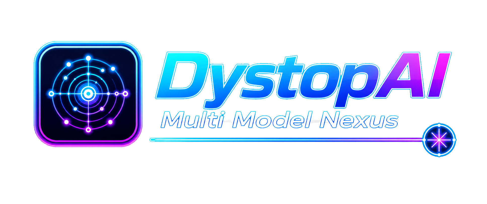
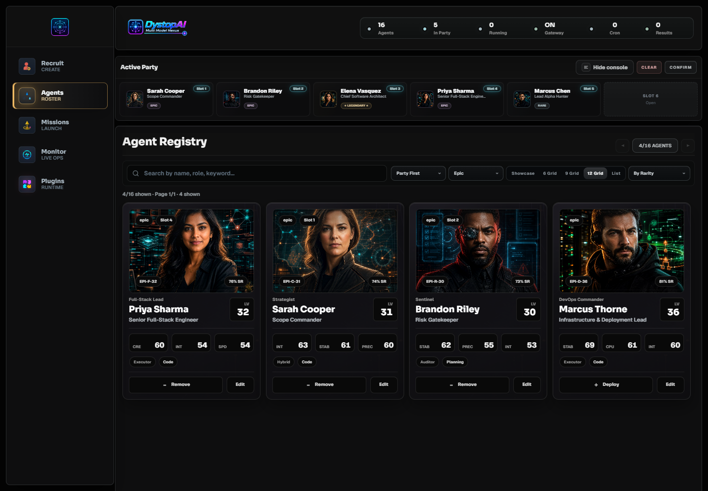
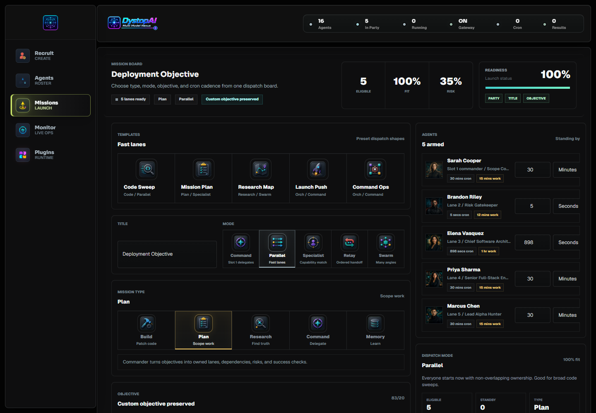
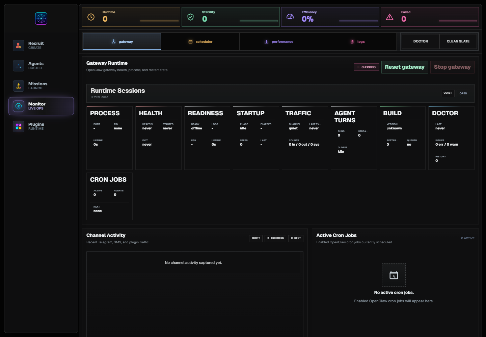
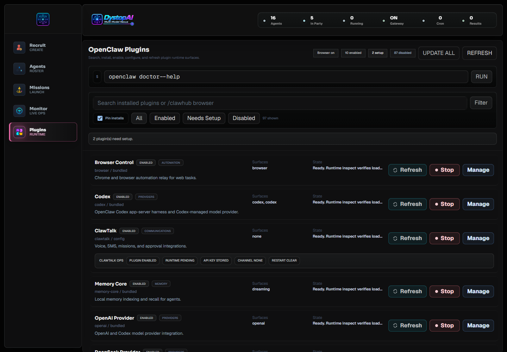
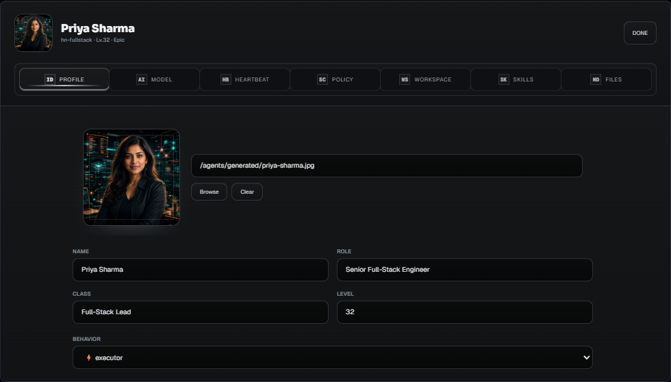
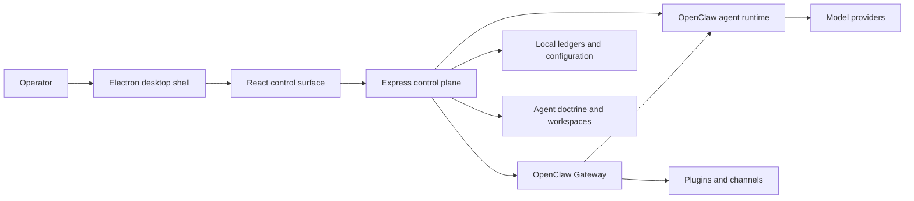

<div align="center">



# DystopAI Core

### A local-first command center for OpenClaw agent teams

Recruit specialized agents, connect multiple model providers, coordinate multi-agent missions, schedule recurring work, and supervise every run from one desktop control plane.

**Multi Model Nexus** · **Local-first** · **Desktop** · **OpenClaw-native**

</div>

> [!IMPORTANT]
> DystopAI Core is in active development. It is designed for a trusted local operator environment and is not an internet-facing, multi-tenant service.

## Overview

DystopAI Core is a desktop control plane for building and operating teams of OpenClaw agents. It brings agent configuration, model authentication, team coordination, scheduled missions, runtime monitoring, plugins, skills, and recovery controls into one coherent interface.

Instead of managing separate terminals, configuration files, sessions, cron jobs, and provider credentials, an operator can use DystopAI to:

- Recruit agents with distinct identities, roles, models, tools, workspaces, and operating doctrine.
- Assemble agents into an active party for direct work or coordinated missions.
- Send commands to one agent, selected agents, or the full confirmed party.
- Launch structured missions with ownership, acceptance gates, verification commands, and timing rules.
- Schedule repeated work through OpenClaw-backed cron missions.
- Watch live responses, active calls, sessions, logs, channels, plugin state, and Gateway health.
- Stop, restart, clean up, and recover the runtime without dropping back into the terminal for every operation.

DystopAI is not another model-specific chat wrapper. It is an operations layer for turning OpenClaw agents into an observable, configurable, and recoverable local system.

## Product Tour

| Agents and Command Console | Mission Board |
| --- | --- |
|  |  |

| Runtime Monitor | Plugins |
| --- | --- |
|  |  |

| Agent Editor |
| --- |
|  |

## What DystopAI Brings Together

| Operational need | DystopAI surface |
| --- | --- |
| Agent identity and configuration | Searchable roster, recruitment flow, editor, doctrine files, workspace and tool policy |
| Direct and team communication | Command Console for one agent, selected agents, or the confirmed party |
| Multi-agent orchestration | Mission types, collaboration modes, ownership, acceptance gates, and verification |
| Scheduled autonomous work | Strike, Shift, Loop, and Watch missions backed by OpenClaw cron state |
| Runtime visibility | Live calls, sessions, logs, channel activity, Gateway health, and failure evidence |
| Recovery and control | Stop, abort, restart, session cleanup, stale-lock handling, and Clean Slate controls |
| Model and provider access | API-key and OAuth lanes across cloud and local providers |
| Extensibility | OpenClaw plugins, channels, skills, learned skills, and ClawHub workflows |

## Core Capabilities

### Agent Roster and Configuration

Every agent can be configured as a distinct worker instead of a generic chatbot profile.

- Identity, portrait, class, role, rarity, level, and behavior profile.
- Capability lanes for code, planning, research, orchestration, and memory.
- Primary model, fallback models, thinking level, timeout, and provider authentication.
- Workspace, sandbox, tool allow and deny policy, heartbeat cadence, and recovery mode.
- Editable doctrine files including `IDENTITY.md`, `SOUL.md`, `BOOTSTRAP.md`, `AGENTS.md`, `USER.md`, `HEARTBEAT.md`, `MEMORY.md`, `TOOLS.md`, and `MISSION_PROMPT.md`.

### Command Console

The Command Console is the everyday operating surface for live work.

- Send a turn to one agent, multiple selected agents, or the confirmed party.
- Attach context and keep agent lanes visually separated.
- Stream live response deltas through the OpenClaw Gateway path.
- Preserve stable session keys and retrieve durable final responses from Gateway history.
- Stop an active turn with abort handling.
- Fall back to CLI or embedded local execution when Gateway transport is unavailable.

### Mission Orchestration

Missions convert a broad objective into coordinated, verifiable work.

**Mission types**

- `Build`: implementation, file ownership, testing, and exact change reporting.
- `Plan`: scope, dependencies, risks, milestones, and ownership.
- `Research`: evidence gathering, uncertainty mapping, and source-backed findings.
- `Command`: delegation, handoffs, blocker resolution, and synthesis.
- `Memory`: durable notes, learned skills, and continuity updates.

**Collaboration modes**

- `Command`: slot 1 delegates work and synthesizes the final result.
- `Parallel`: agents start immediately on separate lanes.
- `Specialist`: only agents with the matching capability run.
- `Relay`: agents work in order and pass context forward.
- `Swarm`: many agents explore a problem from different angles.

**Timing modes**

- `Strike`: one leader, worker, and review cycle.
- `Shift`: repeat cron cycles until the configured time ends.
- `Loop`: continue cron cycles until stopped.
- `Watch`: maintain a persistent background mission.

Mission definitions can include acceptance gates, verification commands, complexity, risk tolerance, heartbeat cadence, and explicit success evidence.

### Runtime Monitor

The Monitor answers the most important operational question: what is the system doing right now?

- Gateway health, PID, uptime, readiness, start, stop, and restart controls.
- Active and recent runtime calls with timing and failure classification.
- Open sessions, session files, locks, stale locks, and cleanup actions.
- Mission events, Gateway logs, channel activity, and diagnostic summaries.
- Scheduled cron jobs with owner, cadence, next run, and stop controls.
- Clean Slate recovery for stale UI and runtime state without blindly terminating healthy work.

### Plugins, Channels, and Skills

DystopAI exposes the OpenClaw extension ecosystem inside the desktop app.

- Inspect installed, enabled, disabled, loaded, and setup-required plugins.
- Enable, disable, install, update, and configure plugin surfaces.
- Inspect plugin commands, providers, channels, dependencies, and runtime state.
- Browse bundled, learned, shared, and ClawHub skills.
- Let agents preserve reusable skills learned from successful work.
- Configure communication plugins such as ClawTalk for SMS, voice, and walkie-style agent routing when available.

### Model Providers and Authentication

Provider credentials remain local and are managed per model lane. Supported paths depend on the active OpenClaw configuration and include providers such as:

- OpenAI API and OpenAI Codex OAuth.
- Anthropic, Google Gemini, Google Vertex, DeepSeek, OpenRouter, xAI, Groq, Mistral, Qwen, Kimi, Cerebras, NVIDIA, and other compatible providers.
- Local or optional-auth runtimes such as Ollama, LM Studio, vLLM, SGLang, Comfy, DuckDuckGo, and SearXNG where supported.

Never commit provider keys, OAuth secrets, or credential files.

## Operator Workflow

1. **Recruit or open an agent.** Define its role, capabilities, model, workspace, tools, and doctrine.
2. **Connect model access.** Add an API key or complete the supported OAuth flow.
3. **Assemble a party.** Deploy agents into ordered slots and confirm the team.
4. **Choose the work surface.** Send a direct Command Console turn or build a structured mission.
5. **Define proof.** Add acceptance gates and verification commands before launching important work.
6. **Observe the run.** Use the console and Monitor to inspect live output, sessions, logs, cron jobs, and Gateway state.
7. **Recover deliberately.** Stop the turn, close stale sessions, restart Gateway, or use Clean Slate when evidence shows cleanup is needed.

## Architecture



### Technology Stack

| Layer | Technology |
| --- | --- |
| Desktop | Electron and electron-builder |
| Frontend | React, TypeScript, Vite, Tailwind CSS, Framer Motion, and Zustand |
| Backend | Express, TypeScript, Zod, server-side route modules, and SSE |
| Runtime | Vendored OpenClaw runtime, Gateway sessions, cron, plugins, and skills |
| Local state | OpenClaw configuration, agent doctrine, workspaces, JSONL ledgers, and desktop user data |
| Quality gates | ESLint, TypeScript checks, control-plane smoke tests, Electron tests, packaging checks, and release evidence validation |

## Getting Started

### Prerequisites

- Node.js `22.19+` recommended. Node.js `24` is also supported by the current project configuration.
- npm.
- Git.
- Provider credentials or OAuth access for the models you plan to use.

### Install

```bash
git clone https://github.com/hotboysupreme12-hash/DystopAI-Core.git
cd DystopAI-Core
npm ci
```

### Run in Development

```bash
npm run dev
```

The development surfaces run locally:

- Frontend: `http://127.0.0.1:5173/`
- Control Plane API: `http://127.0.0.1:4050/`

When `CONTROL_CENTER_TOKEN` is not set, the server generates a local token and prints it in the startup log. Packaged desktop sessions authenticate through the Electron shell.

### Run the Desktop App

```bash
npm run desktop
```

This builds the frontend and server, then launches the Electron shell.

### Build a Windows Installer

```bash
npm run dist:win
```

Generated desktop output is written to ignored build folders such as `release/` and `artifacts/`.

## Essential Commands

| Command | Purpose |
| --- | --- |
| `npm run dev` | Start the backend and Vite frontend together. |
| `npm run desktop` | Build the standalone app and launch Electron. |
| `npm run build:standalone` | Build the production frontend and server bundle. |
| `npm run lint` | Run ESLint across the repository. |
| `npm run typecheck` | Type-check frontend, server, Electron, and preload surfaces. |
| `npm test` | Run the complete local control-plane quality gate. |
| `npm run smoke:electron-e2e` | Validate Electron startup, navigation policy, crash recovery, tray behavior, and cleanup. |
| `npm run package:desktop` | Create an unpacked desktop package for launch validation. |
| `npm run dist:win` | Create the Windows NSIS installer output. |
| `npm run docs:openclaw:sync` | Refresh the local OpenClaw documentation snapshot. |

Before pushing significant changes, run:

```bash
npm run lint
npm run typecheck
npm test
```

Public release work, signing policy, SBOM generation, checksum validation, installer evidence, and release governance are documented separately in [`docs/RELEASE_GOVERNANCE.md`](docs/RELEASE_GOVERNANCE.md).

## Configuration

DystopAI is primarily configured through environment variables and the OpenClaw configuration it manages.

| Variable | Default | Purpose |
| --- | --- | --- |
| `CONTROL_CENTER_PORT` | `4050` | Local Control Plane API and packaged app port. |
| `CONTROL_CENTER_FRONTEND_PORT` | `5173` | Vite development frontend port. |
| `CONTROL_CENTER_TOKEN` | Generated when unset | Local browser session token. |
| `CONTROL_CENTER_WORKSPACE_ROOT` | Project or OpenClaw workspace | Root workspace exposed through the control plane. |
| `OPENCLAW_GATEWAY_PORT` | `18789` | OpenClaw Gateway port. |
| `OPENCLAW_BROWSER_RELAY_PORT` | `18792` | Browser relay port. |
| `OPENCLAW_STATE_DIR` / `OPENCLAW_HOME` | User OpenClaw state directory | Runtime state, agents, skills, sessions, and configuration. |
| `OPENCLAW_CONFIG_PATH` | `<state>/openclaw.json` | Active OpenClaw configuration file. |
| `DYSTOPAI_USER_DATA_DIR` | `~/.dystopai-control-center` | Electron user data directory. |

Advanced runtime and packaging variables live close to the scripts that consume them. Keep environment-specific values outside version control.

## Security Model

DystopAI controls a privileged local agent runtime. Treat it like an administrator console.

- The Control Plane API is intended to bind only to loopback addresses.
- Browser access requires the local bearer token and exact local-origin validation.
- The Electron renderer uses context isolation, sandboxing, a narrow preload bridge, restricted navigation, and denied popup creation.
- OpenClaw agents may receive shell, filesystem, browser, communication, or provider tools based on operator policy.
- Broad tool or workspace access should be granted deliberately and reviewed in each agent's policy and doctrine.
- Provider secrets, OAuth credentials, local sessions, generated runtime data, and release output must remain outside Git.
- Exposing the Control Plane to a LAN or the public internet is outside the current threat model and requires a separate authentication, authorization, transport, and audit design.

The detailed threat model, branch protections, signing policy, and release requirements are documented in [`docs/RELEASE_GOVERNANCE.md`](docs/RELEASE_GOVERNANCE.md).

## Repository Layout

```text
.
|-- electron/                 # Electron shell and desktop process management
|-- server/                   # Express control plane, OpenClaw bridge, and ledgers
|-- src/                      # React application, store, hooks, and UI components
|-- public/                   # Brand assets, portraits, icons, and mission artwork
|-- docs/                     # User guides, architecture notes, and OpenClaw snapshot
|-- scripts/                  # Build, test, packaging, auth, and release utilities
|-- vendor/openclaw/          # Vendored OpenClaw runtime snapshot
|-- build/                    # Tracked source icons used by desktop packaging
|-- dist/                     # Generated frontend build, ignored
|-- dist-server/              # Generated server bundle, ignored
|-- release/                  # Generated desktop output, ignored
`-- artifacts/                # Generated archives and reports, ignored
```

## Documentation

- [`docs/USER_GUIDE.md`](docs/USER_GUIDE.md): operator-focused walkthrough of agents, missions, monitoring, plugins, and model authentication.
- [`docs/OPENCLAW_GATEWAY_COMMAND_CONSOLE_GUIDE.md`](docs/OPENCLAW_GATEWAY_COMMAND_CONSOLE_GUIDE.md): Gateway protocol and Command Console integration guidance.
- [`docs/PRODUCTION_HARDENING_LEDGER.md`](docs/PRODUCTION_HARDENING_LEDGER.md): prioritized engineering and production-readiness work.
- [`docs/RELEASE_GOVERNANCE.md`](docs/RELEASE_GOVERNANCE.md): CI, signing, evidence, release, and threat-model policy.
- [`docs/openclaw-latest/`](docs/openclaw-latest/): local snapshot of the OpenClaw documentation used by the project.

## Project Status

Current package version: `0.0.6`.

DystopAI Core is an active local-first desktop project around a fast-moving OpenClaw runtime. The main product surfaces are implemented, while runtime durability, security hardening, packaging, release evidence, and operator experience continue to evolve.

The production-readiness backlog belongs in the hardening ledger, not in the README. The README is the product's front door: what DystopAI is, what it does, how it works, and how to run it.
