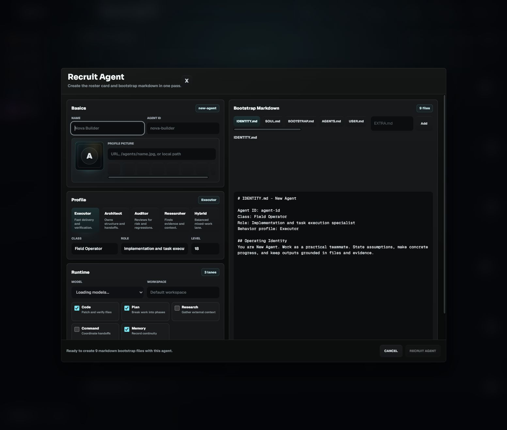
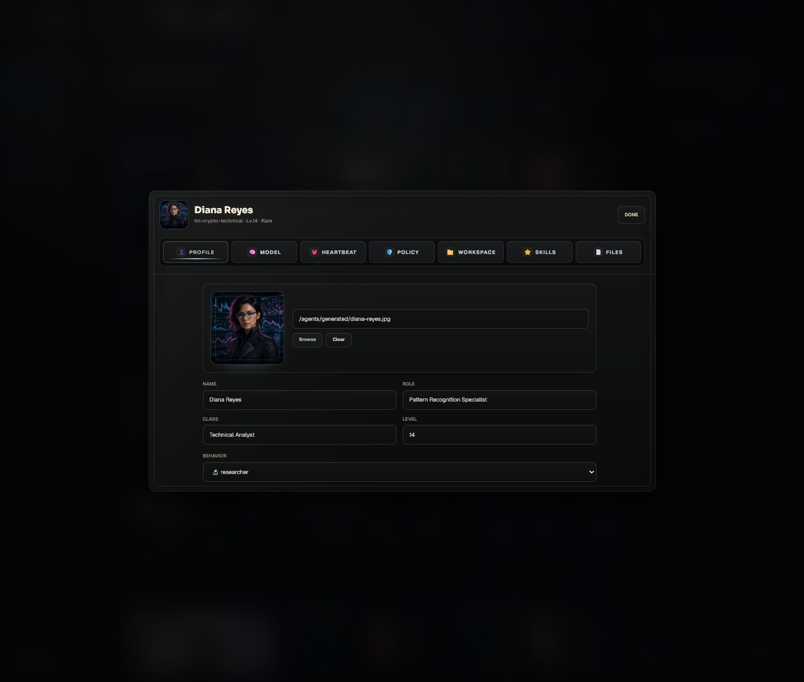
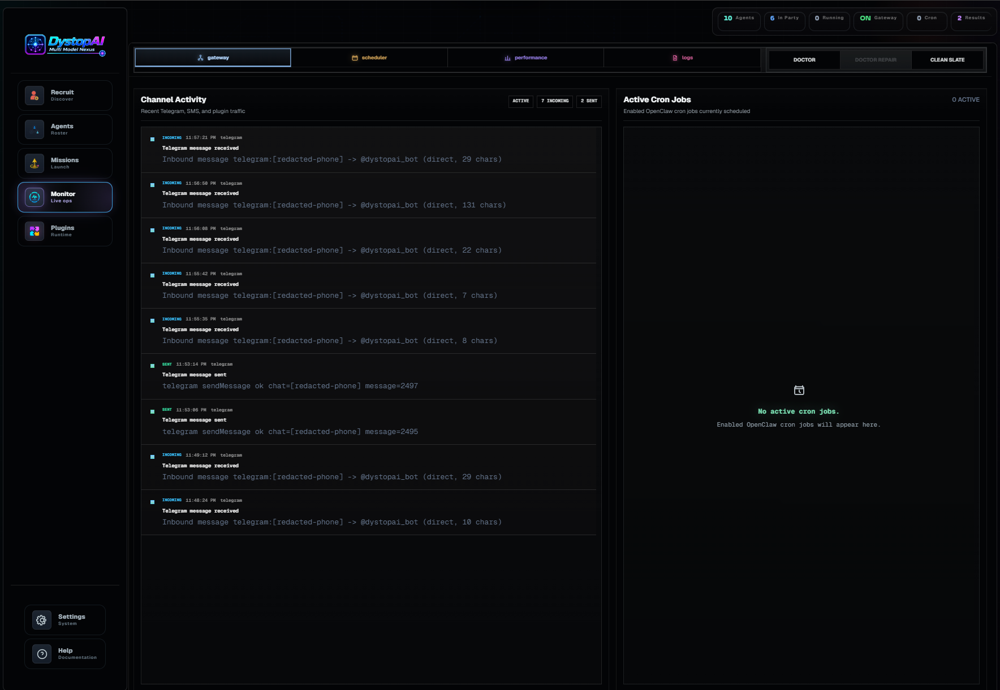
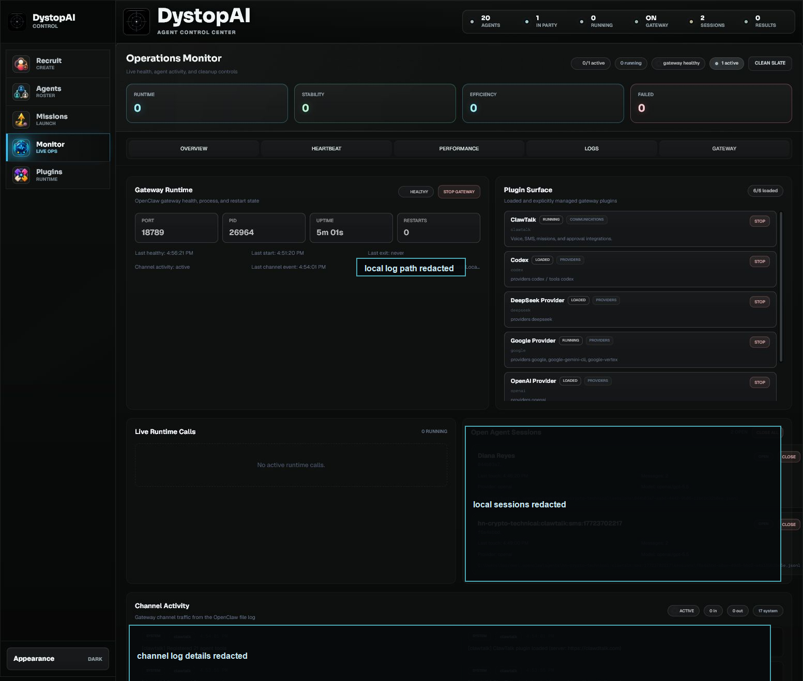
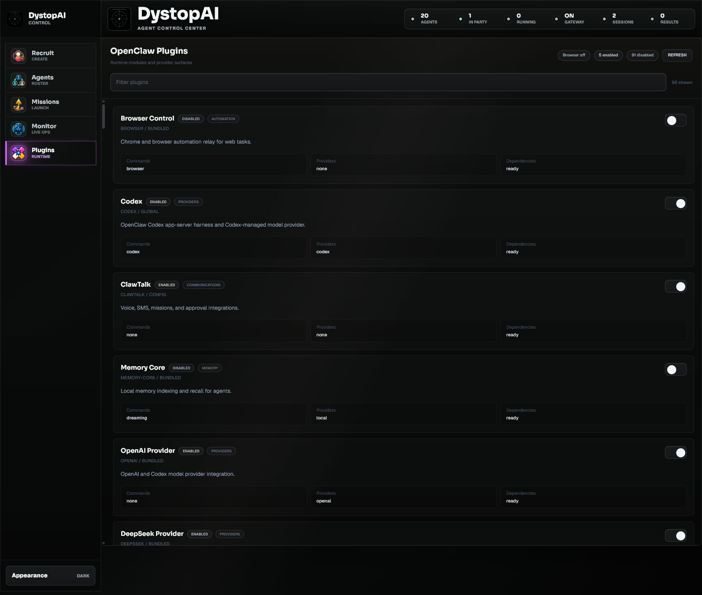

# DystopAI Agent Control Center User Guide

Last updated: 2026-06-06

DystopAI Agent Control Center is a local command surface for running and supervising your OpenClaw agents. Use it to pick agents, chat with them, launch coordinated missions, watch live runtime activity, and start or stop gateway plugins such as ClawTalk.

This guide is written for operators and new users. It focuses on what to click, what each area means, and what to check when something does not behave as expected.

## Quick Start

1. Start the app.
   - Desktop build: open the DystopAI app.
   - Development mode: run `npm ci`, then `npm run dev`.
   - Bundled server mode: run `npm run build:standalone`, then start the packaged app or run the server bundle.

2. Open the Control Center.
   - Local app URL: `http://127.0.0.1:4050/`
   - Development Vite URL, when using `npm run dev`: `http://127.0.0.1:5173/`

3. Log in if prompted.
   - Desktop sessions sign in automatically through the packaged app.
   - Browser sessions use the configured `CONTROL_CENTER_TOKEN`.
   - If no token was configured, use the one-time local token printed in the server startup log.

4. Connect model credentials.
   - Open an agent.
   - Go to `Model`.
   - Pick the primary model.
   - If the app says auth is missing, click `Connect` or `Update Auth`.
   - Use OpenAI Codex OAuth for Codex subscription-backed models.
   - Use API keys for provider API-key models.

5. Add agents to the active party, confirm the party, then send a message or deploy a mission.

## Main Navigation

The left rail is the primary navigation:

| Area | Use it for |
| --- | --- |
| `Recruit` | Create a new agent and its bootstrap markdown files. |
| `Agents` | Browse your roster, build the active party, edit agents, and chat. |
| `Missions` | Define structured work and send it to one or more agents. |
| `Monitor` | Watch active runs, sessions, gateway health, logs, and cleanup controls. |
| `Plugins` | Enable, disable, and inspect OpenClaw runtime plugins. |

The header badges show the live state: total agents, active party size, running turns, gateway state, open sessions, and response count.

## Agents


The Agents tab is the everyday command area.

### Active Party

The Active Party strip holds the agents that will receive party or mission work.

Use it like this:

1. Click `Deploy` on an agent card to add that agent.
2. Drag agents between slots to reorder them.
3. Click `Remove` or the slot `x` to remove an agent.
4. Click `Confirm` before running party-wide work.

Slot order matters. Slot 1 is often treated as the commander or lead lane in mission modes.

### Agent Registry

The registry shows all available agents. Each card shows the agent name, class, role, level, high-level attributes, tags, and party status.

Useful controls:

- Search by name, role, or keyword.
- Sort by party priority, level, name, or rarity.
- Filter by rarity.
- Switch between showcase, grid, and list layouts.
- Use `Edit` to open the agent editor.

### Command Console

The Command Console sends direct messages or party broadcasts.

Common patterns:

- Select one agent, type a prompt, and send it for a direct lane.
- Select multiple agents or use the confirmed party for parallel work.
- Attach a file when the task needs extra context.
- Watch responses appear in the console as they complete.

Good prompts are concrete:

```text
Review the authentication flow. Report bugs first, then list exact files you inspected.
```

Avoid vague prompts when you need a reliable result:

```text
Fix everything.
```

## Recruit Agents



Recruit creates a roster card and the agent's bootstrap files in one pass.

Recommended workflow:

1. Click `Recruit`.
2. Enter a human-readable name.
3. Confirm or edit the generated agent ID.
4. Add a profile picture URL, app-relative image path, or local path.
5. Choose a profile type:
   - `Executor` for implementation and verification.
   - `Architect` for system design and handoffs.
   - `Auditor` for risk and regression review.
   - `Researcher` for evidence gathering.
   - `Hybrid` for mixed work.
6. Choose model, workspace, and runtime lanes.
7. Review the generated bootstrap markdown.
8. Click `Recruit Agent`.

The bootstrap files define the agent's identity, behavior, tools, and operating memory. Keep them specific and practical.

## Edit Agents



Open the editor from an agent card with `Edit`.

Editor tabs:

| Tab | What it controls |
| --- | --- |
| `Profile` | Name, portrait, class, role, level, and behavior profile. |
| `Model` | Primary model, fallbacks, provider auth, thinking level, and run timeout. |
| `Scheduler` | Cron cadence, idle timeout, loop flag, and recovery mode. |
| `Policy` | Sandbox and tool allow/deny policy. |
| `Workspace` | The folder this agent should work in. |
| `Skills` | Installed skills, learned skills, and ClawHub search/install flows. |
| `Files` | Agent control files such as `SOUL.md`, `TOOLS.md`, and related resources. |

Use `Model` whenever an agent fails because of missing credentials, stale OAuth, quota, or wrong provider. Use `Policy` when an agent needs or should be denied specific tools.

## Missions


Missions turn a loose objective into structured work. They are best when you need multiple agents, verification, or repeated background effort.

### Mission Templates

Templates prefill the mission style:

- `Code Sweep`: parallel code review or cleanup.
- `Mission Plan`: planning and ownership breakdown.
- `Research Map`: evidence gathering.
- `Launch Push`: implementation, verification, and polish.
- `Command Ops`: lead-agent delegation and follow-up.

### Mission Modes

| Mode | Use when |
| --- | --- |
| `Command` | Slot 1 should delegate and synthesize. Good default for coordinated work. |
| `Parallel` | Everyone should start immediately on separate lanes. |
| `Specialist` | Only agents matching the capability should run. |
| `Relay` | Agents should work in order, each building on the last handoff. |
| `Swarm` | You want broad ideas or many research angles. |

### Mission Types

| Type | Best for |
| --- | --- |
| `Build` | Code or artifact changes. |
| `Plan` | Scope, milestones, and risks. |
| `Research` | Source-backed findings. |
| `Command` | Delegation and coordination. |
| `Memory` | Learning, recall, and continuity work. |

### Acceptance Gates

Acceptance gates are the proof checklist. Write them as lines, one gate per line.

Example:

```text
At least one user-facing path is verified end to end.
Changed files are named and scoped to the requested feature.
Build or test evidence is reported, or the blocker is explicit.
Residual risks are listed before closing the mission.
```

### Verification Commands

Use commands that prove the work is healthy.

Examples:

```text
npm run build
npm run lint
```

Do not add expensive or destructive commands as defaults. Agents may run these during verification.

### Timing

Open `Timing` to choose the mission duration:

- `Strike`: one leader-worker-review cron cycle.
- `Timed`: cron cycles until the configured duration ends.
- `Loop`: cron cycles until stopped.
- `Watch`: persistent background mission controlled by cron.

Timed, Loop, and Watch missions now run through backend-owned OpenClaw cron jobs. Slot 1 runs first, worker agents run after the leader pass, and Slot 1 reviews the round before the scheduler continues or stops.

## Monitor



The Monitor tab answers one question: what is the program doing right now?

Top badges show:

- Active sessions.
- Running agent calls.
- Gateway health.
- Open sessions.

Subtabs:

| Subtab | Use it for |
| --- | --- |
| `Overview` | Agent state, current phase, uptime, memory, and average turn time. |
| `Scheduler` | Cron cadence, retry count, loop flag, and recovery mode. |
| `Performance` | Turns, success rate, runtime, stability, and efficiency metrics. |
| `Logs` | Mission and runtime event tail. |
| `Gateway` | Gateway process, loaded plugins, live calls, open sessions, channel traffic, and log tail. |

### Gateway Panel



The Gateway panel is the best place to confirm whether background plugins are actually alive.

Key areas:

- `Gateway Runtime`: port, PID, uptime, health, restart count, and stop control.
- `Plugin Surface`: loaded or managed plugins with quick `Stop` controls.
- `Live Runtime Calls`: active agent turns that are still running.
- `Open Agent Sessions`: sessions that can still receive context or be reused.
- `Channel Activity`: inbound, outbound, and system channel events.
- `Gateway Log Tail`: latest gateway stdout/stderr and parsed file-log entries.

Use `Close` on a session when you want to stop reusing that conversation context. Use `Close all` when you want to clear all open runtime sessions. Use `Stop gateway` when you want gateway listeners and channel plugins off until a gateway-backed action starts them again.

`Clean Slate` is a stronger cleanup action for stale UI/runtime state. Use it when the app looks stuck, old sessions look live, or you want a fresh monitor surface.

## Plugins



Plugins are runtime modules and provider surfaces. Some provide model providers, some provide communication channels, and some provide tools.

ClawTalk is bundled with the desktop app and appears enabled on first run. Add the ClawTalk API key in `Setup`, then refresh or restart the gateway so the WebSocket connects. The app automatically keeps enabled and installed plugins in the trusted `plugins.allow` list before the gateway starts.

ClawTalk supports multi-agent targeting with `@agent` prefixes in the same SMS, voice, or walkie channel. It derives aliases from the current OpenClaw agent list whenever the gateway loads, so newly added agents work without hand-editing a big alias table. Use the agent ID, unique first name, unique last name, first-last name, full name, or hyphenated full name: `@Diana`, `@Reyes`, `@Diana Reyes`, `@diana-reyes`, and `@hn-crypto-technical` all route to Diana when her agent ID is `hn-crypto-technical`. Ambiguous short aliases are ignored instead of guessing; use the full name or agent ID when two agents share a name token. Scheduled cron/reminder requests created from a routed message stay under that same target agent.

ClawTalk also refreshes agent routing config before each routed turn. When you save a model, workspace, thinking, timeout, or agent-list change, the next SMS/voice/walkie turn uses the updated agent settings. If the config is temporarily invalid while being edited, ClawTalk keeps using the last usable snapshot until the next valid save.

Common plugin tasks:

1. Use the search field to find a plugin.
2. Toggle a plugin on or off.
3. Watch the status chips:
   - `enabled`: configured to load.
   - `disabled`: configured not to load.
   - `loaded` or `running`: active in the current gateway process.
4. Click `Refresh` after changes or after restarting the gateway.

Important behavior:

- Disabling a plugin should prevent new messages or channel events from waking it.
- Some plugin changes need a gateway restart before the runtime matches the config.
- The Monitor Gateway `Plugin Surface` shows what is loaded in the current gateway process.

For ClawTalk specifically, stop it from either the Plugins tab or Monitor Gateway `Plugin Surface`. Confirm it no longer appears as running and that Channel Activity stops receiving ClawTalk events.

## Provider Auth And Models

Most agent failures come down to model auth, provider quota, or stale sessions.

Use this checklist:

1. Open the agent editor.
2. Go to `Model`.
3. Confirm the Primary Model.
4. If the model shows missing auth, click `Connect`.
5. For Codex subscription-backed models, connect `OpenAI Codex` OAuth.
6. For provider API models, save the provider API key.
7. Save the model config.
8. Send a small test prompt.

If a model works in the direct chat UI but fails from a plugin, check Monitor Gateway logs and Plugin Surface. The plugin may be using a different runtime path, stale session, or disabled provider.

## Good Operating Habits

- Keep the active party small for direct work; add more agents only when you need parallel lanes.
- Put proof in acceptance gates before launching missions.
- Use verification commands when work touches code.
- Close stale sessions before testing a changed auth or model configuration.
- Stop communication plugins when you do not want external messages to wake agents.
- Keep secrets out of mission descriptions and agent prompts unless they are required.
- Treat `Monitor > Gateway` as the source of truth for background activity.

## Troubleshooting

### I cannot log in

Check the token.

- Desktop sessions should sign in automatically through the packaged app.
- Browser sessions need the configured `CONTROL_CENTER_TOKEN`, or the generated one-time token printed in the server startup log.

If the token changed, clear the browser's stored `control-center-token` or log in again.

### The gateway says off, checking, or unhealthy

Open `Monitor > Gateway`.

Try this order:

1. Wait a few seconds for health polling.
2. Check whether port `18789` is shown.
3. Use `Stop gateway`, then run a gateway-backed action to start it again.
4. Restart the Control Center server.
5. Check the Gateway Log Tail for startup errors.

### An agent does not respond

Check:

- Is the agent selected or in the confirmed party?
- Is the primary model configured?
- Does the provider auth show connected?
- Is there a provider quota or rate-limit error?
- Is the agent already busy?
- Is there a stale open session that should be closed?
- Does the prompt require tools that the agent policy denies?

### The wrong agent responded

Check the Command Console `To` chips. Remove agents you do not want in the current chat. If using a party, confirm the party before sending.

### Old context keeps affecting answers

Open `Monitor > Gateway`, then close the relevant session. If you want to reset all runtime context, use `Close all` or `Clean Slate`.

### A plugin still responds after I stopped it

Check both surfaces:

1. `Plugins`: the plugin should be disabled.
2. `Monitor > Gateway > Plugin Surface`: the plugin should not be running or loaded.
3. `Channel Activity`: no new inbound/outbound events should appear for that plugin.

If events still appear, restart the gateway from the Monitor or restart the app server.

### ClawTalk does not show messages or replies

Open `Monitor > Gateway`.

Look at:

- `Plugin Surface`: ClawTalk should be running if you expect SMS/voice activity.
- `Channel Activity`: inbound SMS, outbound SMS, and system events should appear here.
- `Gateway Log Tail`: handler errors, auth errors, and connection errors appear here.
- `Open Agent Sessions`: SMS sessions should show activity when messages are routed to an agent.

If ClawTalk is stopped, new messages should not wake it until you enable it again.

### I see `401 Unauthorized` or invalid token

Reconnect the provider used by the selected model.

- Codex subscription models: reconnect `OpenAI Codex` OAuth.
- API-key models: update the provider API key.
- Google Vertex: check `gcloud` auth, project, and location.

After reconnecting, close stale sessions and retry with a small prompt.

### I see `CLI transcript compaction failed for openai/gpt-5.5`

Current builds keep automatic Codex compaction inside the Codex runtime, so this should not stop a mission. If you see it on an older build or after changing runtimes, use this recovery order:

1. Restart the gateway or restart the app so it loads the current bundled OpenClaw runtime.
2. Open the agent editor, go to `Model`, and confirm `OpenAI Codex` is connected for subscription-backed `openai/gpt-5.5` missions.
3. If the agent is meant to use direct OpenAI API billing instead of Codex OAuth, save an OpenAI API key for that agent.
4. Close the stale session in `Monitor > Gateway`, then relaunch the mission with a small test prompt first.

### I see a subscription or rate-limit message

The provider accepted the credential but denied the request because of account limits or quota.

Options:

- Wait until the provider resets usage.
- Switch the agent to another configured model.
- Reduce parallel lanes.
- Avoid repeated mission loops until quota is available again.

### A mission will not deploy

Check:

- At least one agent is in the active party.
- The party is confirmed.
- The mission has a title and objective.
- Acceptance gates are not empty.
- Model auth is connected for every selected agent.
- No selected agent is already running a long task.

### A mission is running too long

Use `Stop Mission` in the Missions tab, then open `Monitor > Gateway` and close any active sessions or runtime calls that remain.

### Attachments do not work

Check the file path, size, and whether the agent has access to the workspace or tool needed to inspect the file. Some attachment-heavy prompts are routed through the OpenClaw runtime instead of direct streaming, so gateway health matters.

### The Browser plugin is off

Open `Plugins`, search for `Browser Control`, and enable it. Refresh plugins, then retry the browser-related agent task.

## Documentation References

Local project docs:

- [README.md](../README.md)
- [CORE_PROJECT.md](../CORE_PROJECT.md)

Bundled OpenClaw docs:

- [OpenClaw docs index](../vendor/openclaw/docs/index.md)
- [Agent runtime architecture](../vendor/openclaw/docs/agent-runtime-architecture.md)
- [OpenClaw agent runtime](../vendor/openclaw/docs/openclaw-agent-runtime.md)
- [Authentication credential semantics](../vendor/openclaw/docs/auth-credential-semantics.md)
- [Plugin management](../vendor/openclaw/docs/plugins/manage-plugins.md)
- [Building plugins](../vendor/openclaw/docs/plugins/building-plugins.md)
- [Skills](../vendor/openclaw/docs/tools/skills.md)
- [Channels](../vendor/openclaw/docs/channels/index.md)
- [SMS channel](../vendor/openclaw/docs/channels/sms.md)
- [Channel troubleshooting](../vendor/openclaw/docs/channels/troubleshooting.md)
- [Automation troubleshooting](../vendor/openclaw/docs/automation/troubleshooting.md)

## Glossary

| Term | Meaning |
| --- | --- |
| Agent | A configured OpenClaw persona with model, workspace, policy, cron cadence defaults, and skills. |
| Active Party | The set of agents selected for party chat or mission work. |
| Slot 1 | The lead party position, often used as the commander in coordinated missions. |
| Mission | A structured task with mode, objective, acceptance gates, verification, and timing. |
| Gateway | The OpenClaw background process that runs plugins, channels, and gateway-backed runtime activity. |
| Plugin Surface | The currently loaded or managed plugins visible from the gateway monitor. |
| Session | A reusable conversation/runtime context for an agent or channel. |
| ClawTalk | A communication plugin for voice, SMS, missions, and approvals. |
| Provider | A model or service backend such as OpenAI, OpenAI Codex, Google, DeepSeek, or others. |
| OAuth | Browser sign-in based credential flow, used by providers such as OpenAI Codex and Google. |
| API key | Provider-issued secret used to call a provider API directly. |

## Fast Recovery Checklist

When something feels wrong:

1. Open `Monitor`.
2. Check gateway health.
3. Check running calls.
4. Close stale sessions.
5. Read the latest Gateway Log Tail.
6. Confirm provider auth.
7. Retry a small direct prompt.
8. Only then relaunch the mission or plugin flow.
